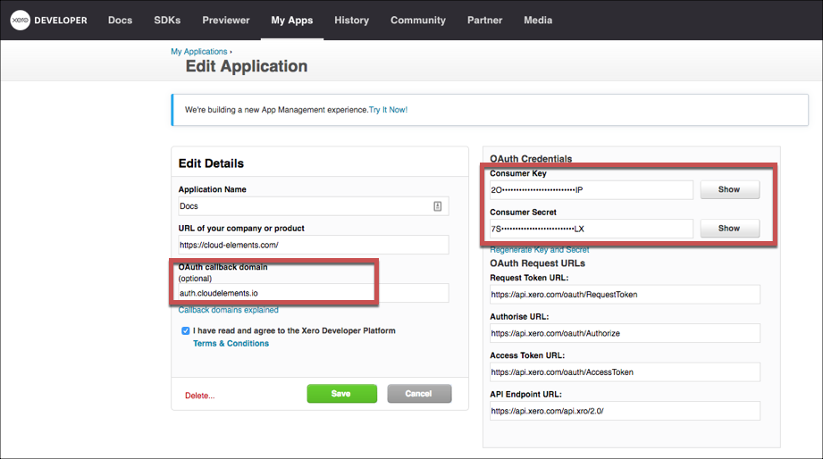

# API Provider Setup

To authenticate a {{page.heading}} element instance you must register an app with {{page.heading}}. When you authenticate, use the **{{page.apiKey}}**, **{{page.apiSecret}}**, and **{{page.callbackURL}}** as the **API Key**, **API Secret**, and **Callback URL**.

See the latest setup instructions in the [{{page.heading}} documentation](https://developer.xero.com/documentation/getting-started/getting-started-guide).



## Locate Credentials for Authentication

If you already created an application, follow the steps below to locate the **{{page.apiKey}}**, **{{page.apiSecret}}**, and **{{page.callbackURL}}**. If you have not created an app, see [Create an Application](#create-an-application).

To find your OAuth 1.0 credentials:

1. Log in to your account at [{{page.heading}}](https://developer.xero.com).
2. Click **My Apps**.
3. Click your app in the list.
3. Record the **{{page.apiKey}}** and **{{page.apiSecret}}**.
3. Record the **{{page.callbackURL}}** for your app.

## Create an Application

If you have not created an application, you need one to authenticate with {{page.heading}}.

To create an application:

1. Log in to your account at [{{page.heading}}](https://developer.xero.com).
2. Click **My Apps**.
2. Click **Add Application**.
3. Enter your app information, and then click **Save**.
3. Click your app in the list.
3. Record the **{{page.apiKey}}** and **{{page.apiSecret}}**.
3. Record the **{{page.callbackURL}}** for your app.

Next [authenticate an element instance with {{page.heading}}](authenticate.html).
