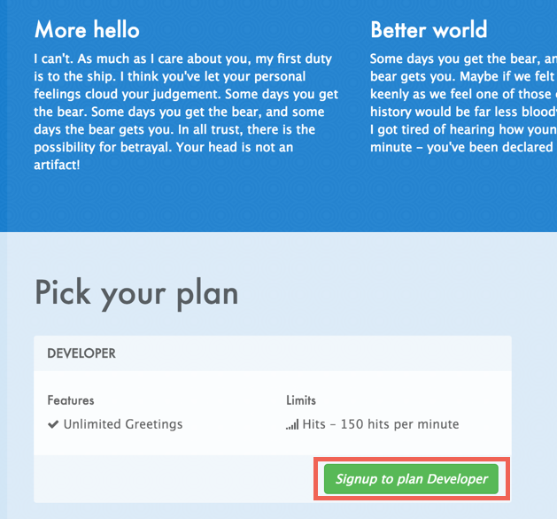
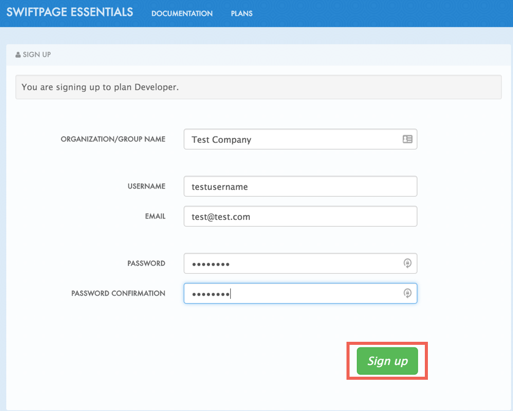
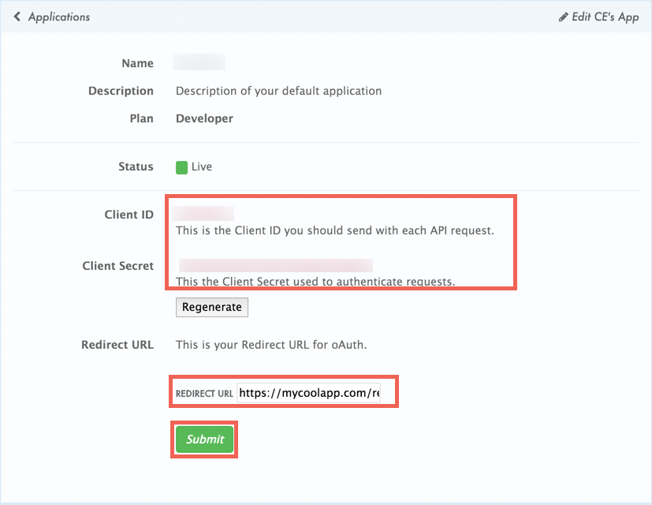

## Endpoint Setup

Follow these instructions to create a new Act Essentials Connected App.

* Sign up for a [Developer Plan](https://actessentials.3scale.net/)

* Complete Form

* Under API Credentials > Edit App to input the OAuth Redirect URL

Next [create an instance](actessentials-create-instance.html).
