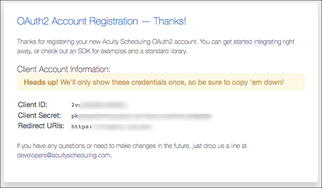

# API Provider Setup

To authenticate an {{page.heading}} element instance you must register an OAuth2 Account. When you authenticate, use the **{{page.apiKey}}**, **{{page.apiSecret}}**, and **{{page.callbackURL}}** as the **API Key** (`oauth.api.key`), **API Secret** (`oauth.api.secret`), and **Callback URL** (`oauth.callback.url`).

You can view the **{{page.apiKey}}**, **{{page.apiSecret}}**, and **{{page.callbackURL}}** only immediately after you register an OAuth2 Account.

## Register

See the latest setup instructions in the [{{page.apiProvider}} documentation](https://developers.acuityscheduling.com/docs/oauth2).

1. Navigate to the  [{{page.apiProvider}} OAuth2 Account Registration page](https://acuityscheduling.com/oauth2/register).
3. Complete the required information, and then click **Register**.
3. Record the **{{page.apiKey}}**, **{{page.apiSecret}}**, and **{{page.callbackURL}}** for your app.

Next [authenticate an element instance with {{page.apiProvider}}](authenticate.html).
