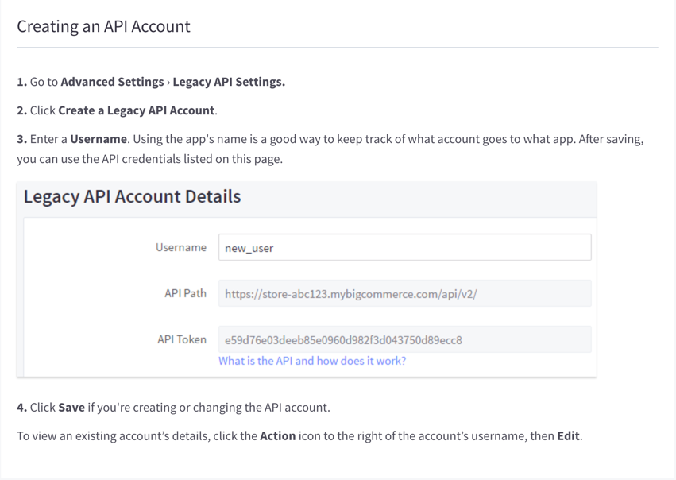

## Endpoint Setup

Log in to your BigCommerce store at [https://login.bigcommerce.com/](https://login.bigcommerce.com/).

1. Get your legacy API Key

2. Copy the Legacy Account Values, as they are needed to create an Element Instance.

Next [create an instance](bigcommerce-create-instance.html).
