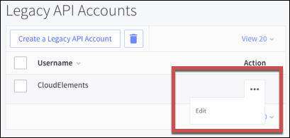

# API Provider Setup

To authenticate a {{page.heading}} element instance you must use a Legacy API account from {{page.heading}}. When you authenticate, use the **Username**, **API Token**, and **API Path** from your Legacy API account.

See the latest setup instructions in the [{{page.heading}} documentation](https://support.bigcommerce.com/articles/Public/Legacy-API-Accounts#creating).



## Locate Credentials for Authentication

If you already set up a Legacy API account, follow the steps below to locate the **API Token** and **API Path**. If you have not created an app, see [Create an Application](#create-an-application).

To find your Legacy API account details:

1. Log in to your your BigCommerce store at [https://login.bigcommerce.com/](https://login.bigcommerce.com/).
2. In the sidebar, click **Advanced Settings**, and then click **Legacy API Settings**.
2. Click the ellipses next to the account that you want to connect, and then click **Edit**.

3. Record the **Username**, **API Token**, and **API Path**.

## Create an Application

If you have not created an application, you need one to authenticate with {{page.heading}}.

To create a Legacy API account:

1. Log in to your your BigCommerce store at [https://login.bigcommerce.com/](https://login.bigcommerce.com/).
2. In the sidebar, click **Advanced Settings**, and then click **Legacy API Settings**.
2. Click **Create a Legacy API Account**.
3. Enter a **Username** and record it to use during authentication.
3. Record the **API Token** and **API Path**.

4. Click **Save**.

Next [authenticate an element instance with {{page.heading}}](authenticate.html).
