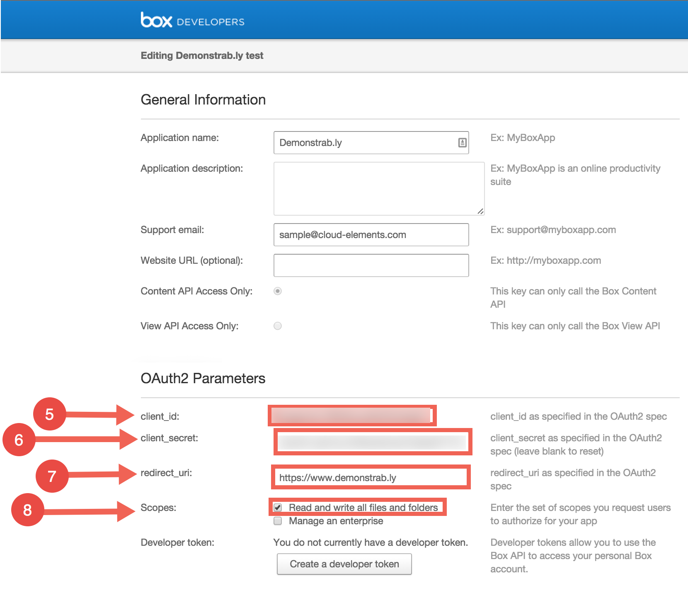

# Service Provider Setup

To setup the endpoint for {{page.heading}}, complete the setup steps described in this section.

1. Via a web browser, go to  [https://app.box.com/developers/services/edit/](https://app.box.com/developers/services/edit/).

2. Input an application name.

3. Select the type of Box application.

4. Click **Create Application**

5. After the Box application is created, click **Configure your application**.

6. Copy the **client_id** and the **client_secret**.

7. Input a **redirect_uri** (your app’s callback URL).

8. Select the appropriate **Scopes** for the application.

    
    

Next [authenticate an element instance with {{page.heading}}](authenticate.html).
