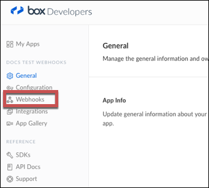

# API Provider Setup

To authenticate a {{page.heading}} element instance you must [register an app](#register-an-app) with {{page.heading}} and know the **client_id,** **client__secret**, and **redirect_uri** of the app. You will use these as the API Key, API Secret, and Callback URL when you authenticate an element instance.

If you plan to use events, you also need to [perform some additional configuration](#set-up-webhooks).

## Register an App

To setup the endpoint for {{page.heading}}, complete the setup steps described in this section.

1. Via a web browser, go to  [https://app.box.com/developers/services/edit/](https://app.box.com/developers/services/edit/).

2. Input an application name.

3. Select the type of Box application.

4. Click **Create Application**

5. After the Box application is created, click **Configure your application**.

6. Copy the **client_id** and the **client_secret**.

7. Input a **redirect_uri** (your app’s callback URL).

8. Select the appropriate **Scopes** for the application.

    
    

## Set Up Webhooks

If you plan to use webhooks to monitor events, you must set up webhooks with Box.

To set up webhooks:

1. Navigate to your app.
2. Click **Webhooks** in the left nav area.

3. Scroll to the bottom of the page, and then click **Create a new Webhook**.
4. Complete the General Information.
5. Add any events that you want to monitor to Event Triggers.
6. In Endpoint URL, enter `https://api.cloud-elements.com/elements/api-v2/events/box`.
5. Maintain a  **Payload format** of **REST**.
6. Create the following **Callback Parameters**:

    | Method | Parameter Name   | Parameter Value   |
    | :------------- | :------------- | :------------- |
    |  Post  |  itemType  |  #item_type#  |
    |  Post  |  newItemId  |  #new_item_id#  |
    |  Post  |  userId  |  #to_user_ids#  |
    |  Post  |  event  |  #event_type#  |
    |  Post  |  itemId  |  #item_id#  |

7. Click **Save Webhook**.

    

8. Box requires you to submit a Support Request to enable webhooks for your app. You must complete this step before you will receive events from Box. Go to this URL: [https://developers.box.com/view-webhooks/](https://developers.box.com/view-webhooks/)
9. Scroll to the bottom of the page and click **Contact Us** to submit a request. You will need your API Key. This can be found at the bottom of the app configuration screen.

Next [authenticate an element instance with {{page.heading}}](authenticate.html).
