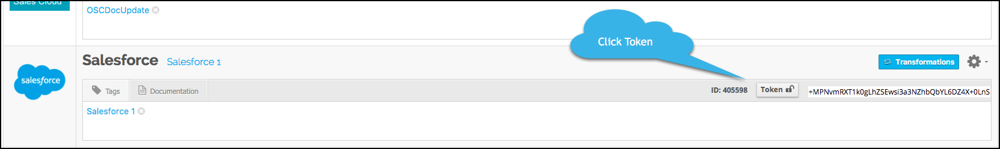

## Welcome to the BrightTALK Element

What should be in an overview? Description of the element, what it supports (bulk, events, transformations), the authorization type, where to get their API docs. What else?

Description of the Element (currently in Create Instance). The vendor's website or programmableweb are good paces to grab a brief description. Do we have anything internally?. 

BrightTALK is a webinar and video meeting service provider. The BrightTALK Element supports the following features:

 * Transformations
 * Bulk

 To get started with the BrightTALK element, you should be familiar with the [BrightTALK API documentation](https://developer.brighttalk.com/docs/) and know the following information about your BrightTALK account:

 * API Key
 * API Secret

 Jump to any of the following sections to learn more about the element:

 [Setup Overview](#setup-overview)

 [About Elements](#about-elements)

 [Base URL](#base-url)

 [Authenticating with Cloud Elements](#authenticating-with-cloud-elements)

### Setup Overview

To create a connection to BrightTALK:

1. Retrieve your BrightTALK API Key and API Secret.
2. Call the `POST /instances` API to instantiate your BrightTALK connected app.

### About Elements

Do we need this part? it is a description of what an element is, so we could just reference the Element definition elsewhere. If we keep this section, I suggest doing so as an include.

An Element is a collection of resources providing a pre-built integration into a service endpoint. RESTful methods (POST, GET, PUT, PATCH, DELETE) interact with these resources (accounts, contacts, files) regardless of the type of APIs (SOAP or REST) provided by the endpoint. Elements leverage Cloud Elements API Manager platform services including authentication, data transformation, and event management.  The API is built to allow you to create a functional application or integration quickly and easily.

This part might actually be useful as a "Base URL" section...

### Base URL

The Cloud Element Base URL for all API calls is `https://api.cloud-elements.com/elements/api-v2`

HTTP requests to the REST API are protected with HTTP Basic authentication with your Organization and User secret and an Element token. We use many standard HTTP features, like HTTP verbs, understood by most HTTP clients. JSON is returned in all responses from the API, including errors. The APIs have predictable, straightforward URLs and use HTTP response codes to indicate API errors.

### Authenticating with Cloud Elements

To authenticate with Cloud Elements, you need to know your Organization Secret and User Secret. When making some calls, you also need to know the Element Token.

When you create an account with us, we assign you an Organization Secret and a User Secret. An Organization is a customer of Cloud Elements (`/organizations`). The User and Organization secrets represent your account with Cloud Elements.

To find your Organization and User Secret, click __Secrets__ in the API Manager Console:

When you create a new connection to an endpoint, you will receive an Element token. After you create an instance, Cloud Elements automatically refreshes the token behind the scenes so that you won't need to connect your application again.

To find your Element token:

* Open the the API Manager Console, go to My Instances, and then click __Token__.
    

    or

* `GET /instances/<INSTANCE_ID>`

An Element token and a User secret are required to execute one of our Hub API calls (e.g. `/hubs/documents/files` or `/hubs/crm/contacts`). For more information about Hubs, see [Hub API Docs](../../hubs/hub-docs)

Pass tokens and secrets as basic HTTP Header values.

* To make a Platform or API call, include the following in the header:

    `Authorization: User 7OpR4MRo7wnPoVKkKFXHhHBUPRzqutoem/d+WEnR1kY=, Organization ce7f1f9be0d2a8b1f37bcfa6d71eda20`

* To make a Hub API call, include the following in the header:

    `User 7OpR4MRq7wnpnVKkKFXhhHbUPRzQutoem/d+WEnR1kY=, Element fJ5HQ135fW4okMt5AWq0hzm2X7kaK5OpQB0Uxjvlz6U=`

Get started by [creating an instance](BrightTALK-crm-create-instance.html).
