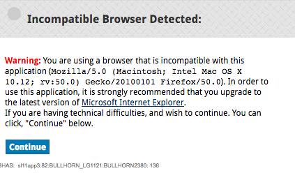

## Tips

When creating an instance, the `GET oauth/bullhorn/url` API call takes me to the Bullhorn authorization page.  Sometimes the `LOGIN` button is disabled on the Bullhorn auth page.
What should I do?

First, submit a support ticket to Bullhorn.

Open up the developer tools in the browser and edit the `HTML` for the button:
change `disabled` to `active` in the `input` form, then finish the authentication process.

Does the Bullhorn UI only work with Internet Explorer?

Yes, when you are on a different browser such as Chrome or Firefox, you may encounter this error message:

