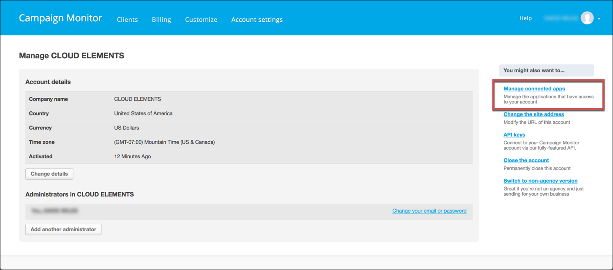
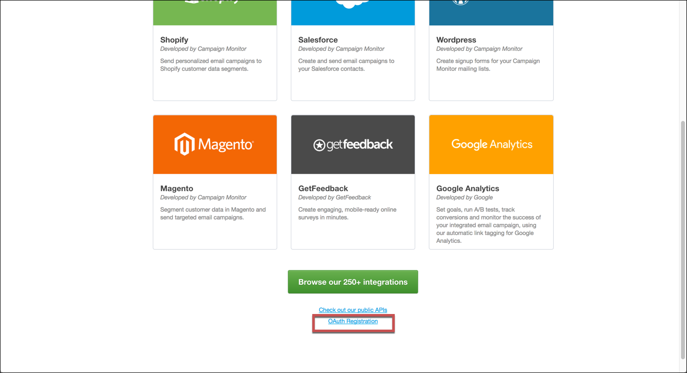
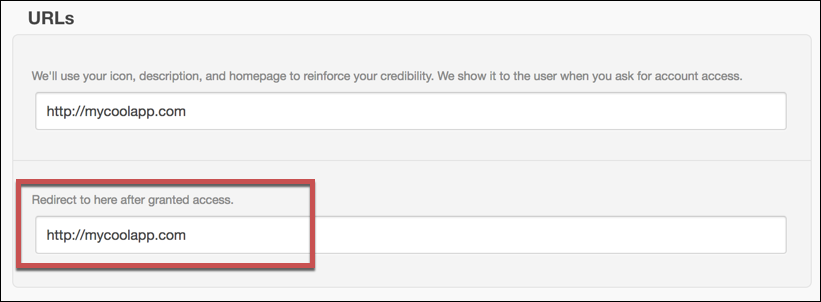
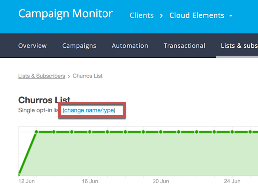

# API Provider Setup

To authenticate a {{page.heading}} element instance you must either use an API Key or [register a connected app](#register-a-connected-app) with {{page.heading}}, and use the **Client ID,** **Client Secret**, and **Callback URL** of the app. Also, if you plan to use events, you need to know the [List ID](#find-a-list-id) of any lists that you want to monitor for events.

Read more about the Campaign Monitor authentication choices: [Authenticating with an API key](https://www.campaignmonitor.com/api/getting-started/#authenticating-api-key) and [Authenticating with OAuth](https://www.campaignmonitor.com/api/getting-started/#authenticating-with-oauth).

## Register a Connected App



To register a connected app:

1. Log in to your {{page.heading}} account.
1. Navigate to the Account Settings. Click your profile in the top right, and then select **Account Settings**.
2. In the menu on the right, click **Manage connected apps**.

2. Scroll down, and then click **OAuth Registration** under the available integrations.

3. Complete the required information and upload a logo.
4. Record the URL you enter in **Redirect to here after granted access** as your Callback URL where the user returns after authentication. Enter this URL whenever prompted to enter a **Callback URL** when you [authenticate an element instance](authenticate.html).

6. Click **Register**.
7. Record the  **Client ID** and **Client Secret**. When you [authenticate an element instance](authenticate.html), use **Client ID** as the `apiKey` and **Client Secret** as the `apiSecret`.

## Find a List ID

If you plan to use events, you need to know the List ID of any lists that you want to monitor for events.

To find a List ID:

1. Navigate to the list. Click **Lists and subscribers**, and then click a list name.
2. Click **change name/type** under the list name at the top left of the page.

3. Record the **API Subscriber List ID,** which you can use as the **List ID** when [authenticating an element instance with events](events.html).

Next [authenticate an element instance with {{page.heading}}](authenticate.html).
