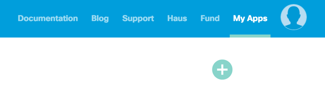
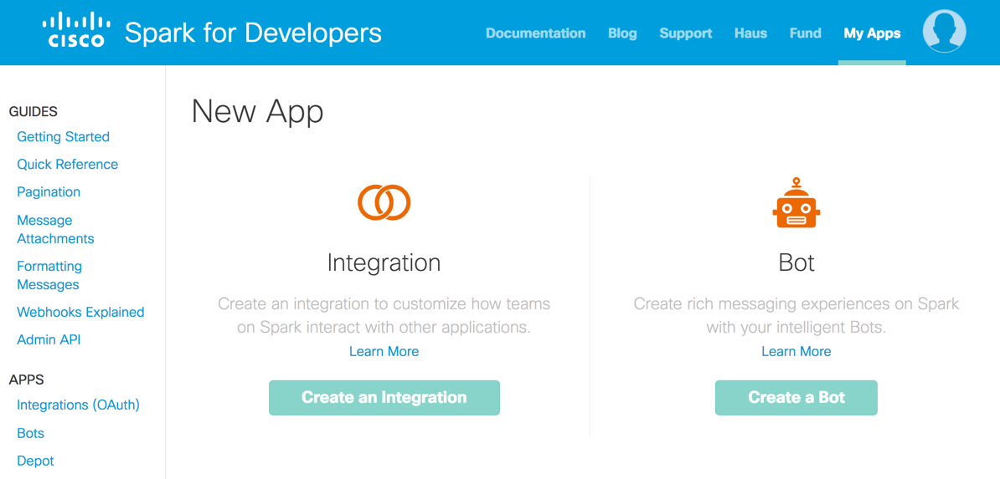
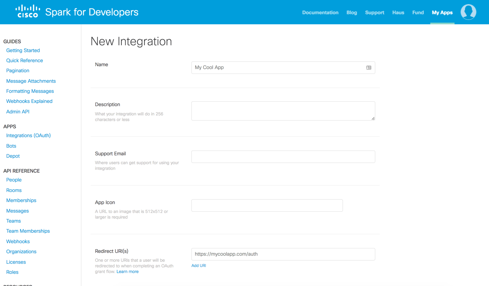
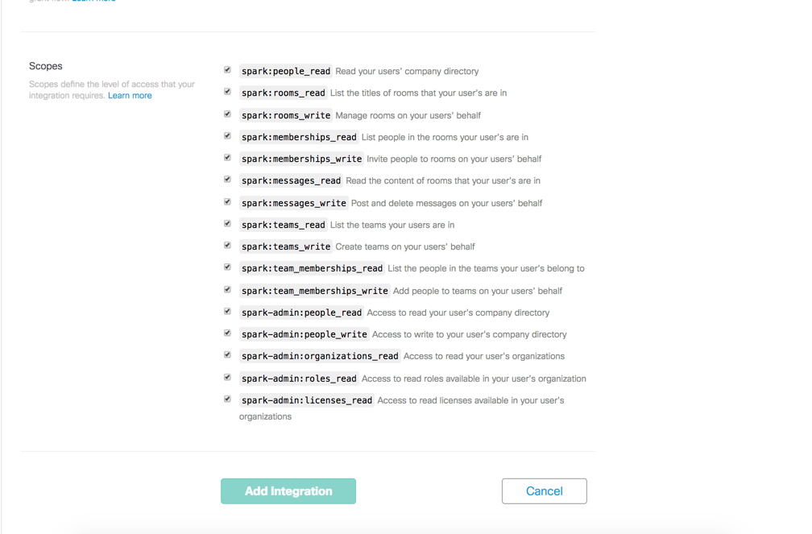

## Endpoint Setup

Follow these instructions to create a new Cisco Spark Connected App.

NOTE: these are the minimum number of steps to create a connected app needed to create an instance.

Visit the [Cisco Spark API Documentation](https://developer.ciscospark.com/getting-started.html) for more detailed information regarding their API.

* Log in to your Cisco Spark profile [https://developer.ciscospark.com/](https://developer.ciscospark.com/)

* Create an App

* Click Create an Integration

* Input the app information

* Select the scopes for your application and click Add Integration

Cloud Elements recommends visiting the Cisco Spark API Documentation and reviewing the information posted regarding the [OAuth Scope and Permissions](https://developer.ciscospark.com/authentication.html).

Next [create an instance](cisco-spark-create-instance.html).
