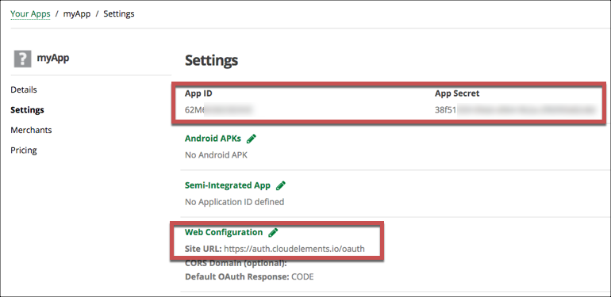
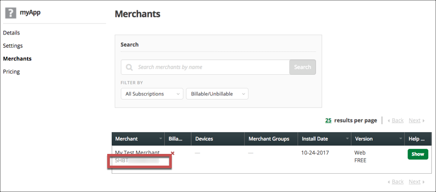
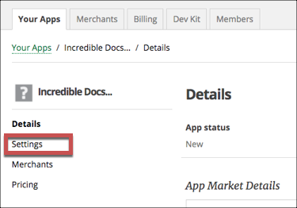
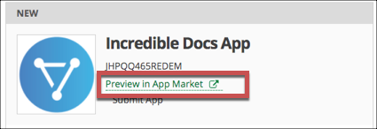
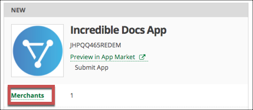

# API Provider Setup

To authenticate a {{page.heading}} element instance you must register an app with {{page.apiProvider}}. When you authenticate, use the **{{page.apiKey}}**, **{{page.apiSecret}}**, and **{{page.callbackURL}}** as the **OAuth API Key**, **OAuth API Secret**, and **OAuth Callback URL**.

In addition, the app that you want to connect to must be in use by a merchant and you must know that **Merchant ID**.

See the latest setup instructions in the [{{page.apiProvider}} documentation](https://docs.clover.com/build/web-apps/).



## Locate Credentials for Authentication

If you already created an application, follow the steps below to locate the **{{page.apiKey}}**, **{{page.apiSecret}}**,  **{{page.callbackURL}}**, and **Merchant ID**. If you have not created an app, see [Create an Application](#create-an-application).

To find your OAuth 2.0 credentials and Merchant ID:

1. Log in to your account at [{{page.apiProvider}}](https://www.clover.com/developers/).
2. Locate the application that you want to connect, and then click **Settings**.
3. Record the **{{page.apiKey}}**, **{{page.apiSecret}}**, and **{{page.callbackURL}}** for your app.

4. Click **Merchants**, and then record the **Merchant ID**.

## Create an Application

If you have not created an application, you need one to authenticate with {{page.apiProvider}}. You also need to add pricing to the app and have at least one merchant connect to it.

To create an application:

1. Log in to your account at [{{page.apiProvider}}](https://www.clover.com/developers/).
2. Click **Create New App**.
3. Complete the required information.
4. Click **Create**.
5. Click **Settings**.

6. Click **Web Configuration**, and then in **Site URL** enter the OAuth Callback URL.
7. Click **Save**.
6. Record the **{{page.apiKey}}**, **{{page.apiSecret}}**, and **{{page.callbackURL}}** for your app.

7. Click **Pricing** and set up your pricing options. You must add at least one subscription in addition to a free trial to preview the app.
8. Return to **Your Apps** .
9. Click **Preview in App Market**.

10. Using a test merchant, select a subscription, and the click **Accept and Install**.

    You're returned to the **{{page.callbackURL}}** for your app.

8. Return to **Your Apps**, and then click **Merchants** under the app that you just tested.

9. Record the **Merchant ID**.

Next [authenticate an element instance with {{page.apiProvider}}](authenticate.html).
