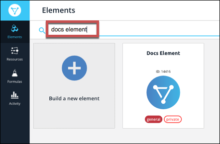

# Authenticate with {{page.heading}}

You can authenticate with {{page.heading}} to create your own instance of the {{page.heading}} element through the {{site.console}} or through APIs. Once authenticated, you can use the element instance to access the different functionality offered by the {{page.heading}} platform.



## Authenticate Through the UI

Use the {{site.console}} to authenticate with {{page.heading}} and create an element instance.

1. Sign in, and then search for the element in our Elements Catalog.

    | Latest UI | Earlier UI  |
    | :------------- | :------------- |
    |    |    |

3. Create an element instance.

    | Latest UI | Earlier UI  |
    | :------------- | :------------- |
    | Hover over the element card, and then click __Create Instance__.</br>   | Click __Add Instance__.</br>   |

5. Enter a name for the element instance.
6. Complete the Instance Configuration parameters. See [Parameters](#parameters) for information about each parameter.
7. Click __Create Instance__ (latest UI) or __Next__ (earlier UI).
8. Optionally add tags in the earlier UI:
     1. On the Tag It page, enter any tags that might help further define the instance.
      * To add more than one tag, click __Add__ after each tag.
      
     1. Click __Done__.
8. Provide your Concur credentials, and then allow the connection.
8. Take a look at the documentation for the element resources now available to you.

## Authenticate Through API

Use the `/instances` endpoint to authenticate with {{page.heading}} and create an element instance. If you are configuring events your will need to include event information. See the [Events section](events.html).



### Request Body

You must include a JSON body with your `/instances` request.  See [Parameters](#parameters) for information about each parameter. The Boolean parameters show default values.

__Note__: The following example JSON show webhooks enabled. You can also enable polling which requires a more detailed configuration. See [Events](events.html) for more information.

To create an element instance:

1. Construct a JSON body as shown below (see [Parameters](#parameters)):

```json
{
  "element": {
    "key": "concur"
  },
  "configuration": {
	"store.url": "<http://mycoolstore.com>",
	"oauth.api.key": "<CONSUMER_KEY>",
	"oauth.api.secret": "<CONSUMER_SECRET>",
	"filter.response.nulls": true,
	"event.vendor.type": "webhook",
	"event.notification.callback.url": "http://mycoolstore.com",
  "event.notification.signature.key": "123456"
  },
  "tags": [
	"Docs"
  ],
  "name": "ConcurForDocs"
}
```

1. Call the following, including the JSON body you constructed in the previous step:

        POST /instances



## Sample cURL

Below is an example cURL request:

```
curl -X POST  \
 -H 'Authorization: User <INSERT>, Organization <INSERT>'  \
 -H 'Content-Type: application/json'  \
 --data '{ \
  "name": "<ELEMENT_INSTANCE_NAME>", \
  "configuration": { \
    "filter.response.nulls": "true", \
    "event.vendor.type": "webhook", \
    "event.notification.enabled": true, \
    "store.url": "http://<URL>", \
    "oauth.api.key": "<CONSUMER_KEY>", \
    "oauth.api.secret": "<CONSUMER_SECRET>", \
    "event.notification.callback.url": ""<INSERT_YOUR_APPS_CALLBACK_URL>", \
    "event.notification.signature.key": "12345" \
  } \
}'  \
'https://api.cloud-elements.com/elements/api-v2/elements/2881/instances'
```

## Parameters

API parameters are in `code formatting`.

| Heading | Heading   | Data Type |
| :------------- | :------------- | :------------- |
| 'key' | The element key.<br>concur  | string  |
| Name</br>`name` |  The name for the element instance created during authentication.   | Body  |
| OAuth API Key</br>`oauth.api.key` | The Key from Concur. |  string |
| OAuth API Secret</br>`oauth.api.secret` |  The Secret from Concur.| string |
| Filter null values from the response </br>`filter.response.nulls` | *Optional*. Determines if null values in the response JSON should be filtered from the response. Yes or `true` indicates that Cloud Elements will filter null values. </br>Default: `true`.  | boolean |
| Events Enabled </br>`event.notification.enabled` | *Optional*. Identifies that events are enabled for the element instance.</br>Default: `false`.  | boolean |
| Event Type </br>`event.vendor.type` | *Optional*. identifies the type of events enabled for the instance. The {{page.heading}} element supports only `polling`. | string |
| Event Notification Callback URL</br>`event.notification.callback.url` |  Where do you want CE to send the events that we generate?. | string |
| Event Notification Signature Key </br>`event.notification.signature.key` | *Optional*. A user-defined key for added security to show that events have not been tampered with. | string |
| Event poller refresh interval (mins)</br>`event.poller.refresh_interval`  | A number in minutes to identify how often the poller should check for changes. |  number|
| Configure Polling </br>`"event.poller.configuration"` |  |  |
| reports</br>`"event.poller.configuration": "{"reports"...}"` (see [Events](events.html))| *Optional*</br>The Concur `reports`. resource available for polling. |JSON object |
| tags | *Optional*. User-defined tags to further identify the instance. | string |
