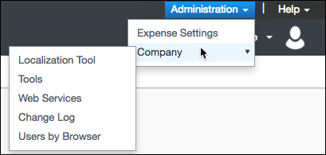

## Endpoint Setup

To set up the Concur endpoint, you need to have an account and create or already have an app.



To set up the endpoint:

1. Log in Concur.
2. Go to __Administration > Company > Web Services__.

3. Click  __Register Partner Application__.
4. Click __New__.
5. Complete the required information and select all APIs that you want to access.
5. Copy your Key and Secret. These will be used to authenticate your element with Concur.
6. Click __OK__.

Next [authenticate with Concur to create an element instance](concur-create-instance.html).
