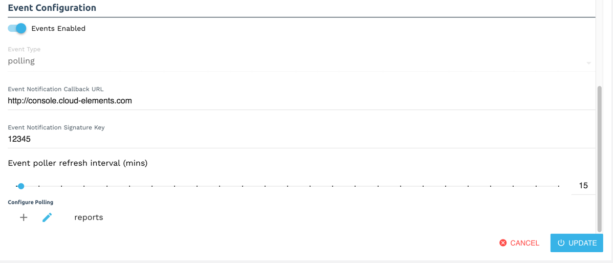

# Events



The Concur element supports polling.

## Polling

You can configure Polling through the UI or in the JSON body of the `/instances` API call.

### Configure Polling Through the UI

To add polling when authenticating through the UI:

1. Switch on __Events Enabled__.
2. Add an Event Notification Callback URL.
3. Optionally include a Callback Notification Signature Key.
4. Use the __Event poller refresh interval (mins)__ slider or enter a number in minutes to specify how often Cloud Elements should poll for changes.
6. Optionally, click the pencil icon to further configure polling.

When finished adding your polling configuration, the Event Configuration section should look like this:



### Configure Polling Through API

To add polling when authenticating through the `/instances` API call, add the following to the `configuration` object in the JSON body.

```json
{
"event.notification.enabled": "true",
"event.vendor.type": "polling",
"event.notification.callback.url": "<INSERT_YOUR_APPS_CALLBACK_URL>",
"event.notification.signature.key": "<INSERT_SIGNATURE_KEY>",
 "event.poller.configuration": "{}"
}
```



#### Example JSON with Polling

```json
{
  "element": {
    "key": "concur"
  },
  "configuration": {
    "oauth.api.key":"UPjRvqOyYz9hDdWLLLLuQV",
    "oauth.api.secret":"GNnU6D7uvWMjOyOEsU7uL1Xc4iaEdEOa",
    "oauth.callback.url":"https://httpbin.org/get",
    "event.vendor.type": "polling",
     "event.notification.callback.url": "http://mycoolstore.com",
     "event.notification.signature.key": "123456",
     "event.poller.configuration": {
       "reports": {
         "url": "/hubs/expense/reports?where=modifiedDateAfter='${date:yyyy-MM-dd'T'HH:mm:ss.SSS}'",
     		"idField": "ID",
     		"datesConfiguration": {
     			"updatedDateField": "LastModifiedDate",
     			"updatedDateFormat": "yyyy-MM-dd'T'HH:mm:ss.SSS",
     			"createdDateField": "CreateDate",
     			"createdDateFormat": "yyyy-MM-dd'T'HH:mm:ss.SSS"
        }
      }
    }
  },
  "tags": [
     "Docs"
  ],
  "name": "ConcurForDocs"
}
```
