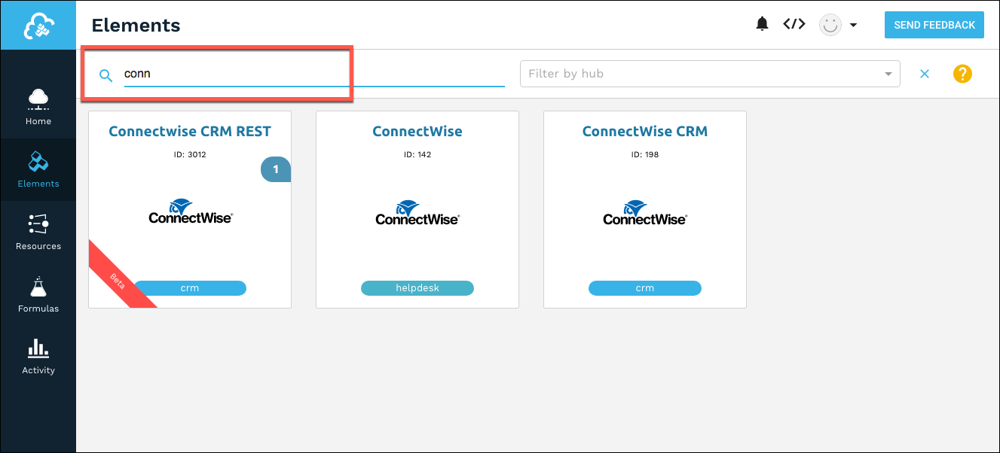

# Authenticate with ConnectWise

You can authenticate with ConnectWise to create your own instance of the ConnectWise REST element through the {{site.console}} or through APIs. Once authenticated, you can use the element instance to access the different functionality offered by the ConnectWise REST element.



## Authenticate Through the UI

Use the {{site.console}} to authenticate with {{page.heading}} and create an element instance.

1. Sign in, and then search for the element in our Elements Catalog.

3. Hover over the element card, and then click __Create Instance__.

5. Complete the Configuration parameters. See [Parameters](#parameters) for information about each parameter.
6. Click __Create Instance__.
7. Take a look at the documentation for the element resources now available to you.

## Authenticate Through API

Use the `/instances` endpoint to authenticate with {{page.heading}} and create an element instance.

__Note__: An Element token is returned upon successful execution of this API. Retain the token for all subsequent requests involving this element instance.

The `/instances` API call includes:

* __HTTP Headers__: Authorization- User <user secret>, Organization <organization secret>
* __HTTP Verb__: POST
* __Request URL__: /instances
* __Request Body__: Required – see below
* __Query Parameters__: none

### Request Body

You must include a JSON body with your `/instances` request.  See [Parameters](#parameters) for information about each parameter. The Boolean parameters show default values.

__Note__: If you don't specify a required parameter, your response results in an error.

```json
{
  "element": {
    "key": "connectwisecrmrest"
  },
  "configuration": {
	"baseUrl": "https://api-<MYCONNECTWISE.COM>/v4_6_release/apis/3.0",
	"company": "<COMPANY_NAME>",
	"public.key": "<PUBLIC_KEY>",
	"private.key": "<PRIVATE_KEY>"
  },
  "tags": [
	"Docs"
  ],
  "name": "ConnectWise_Instance"
}
```

## Parameters

API parameters are in `code formatting`.

| Heading | Heading   | Data Type |
| :------------- | :------------- | :------------- |
| 'key' | The element key.<br>connectwisecrmrest  | string  |
|  Name</br>`name` |  The name for the element instance created during authentication.   | Body  |
| Connectwise URL</br>`baseUrl` | The url of your ConnectWise site with `api-` appended.</br> Be sure to add your url only to the siteURL section of the entire URL, so the entire value looks like: `https://<api-myconnectwise.com>/v4_6_release/apis/3.0`.<br> Where `<api-myconnectwise.com>` is one of the following: <ul><li>`api-eu.myconnectwise.net`</li><li>`api-au.myconnectwise.net`</li><li>`api-na.myconnectwise.net`</li><li>`api-staging.connectwisedev.com`</li></ul>| string |
| Company</br>`company` | The company name that you use to log in. |  string |
| Public Key</br>`public.key` |  The Public Key from ConnectWise. See [Endpoint Setup](connectwise-rest-endpoint-setup.html)| string |
| Private Key</br>`private.key` | The Private Key from ConnectWise. See [Endpoint Setup](connectwise-rest-endpoint-setup.html)| string |
| Filter null values from the response </br>`filter.response.nulls` | *Optional*. Determines if null values in the response JSON should be filtered from the response. Yes or `true` indicates that Cloud Elements will filter null values. </br>Default: `true`  | boolean |

## Sample Request

Below is an example cURL request:

        curl -X POST \
          https://api.cloud-elements.com/elements/api-v2/instances \
          -H 'Authorization: User <INSERT>, Organization <INSERT>'  \
          -H 'content-type: application/json' \
          -d '{
          "element": {
            "key": "connectwisecrmrest"
          },
          "configuration": {
          "baseUrl": "https://api-<MYCONNECTWISE.COM>/v4_6_release/apis/3.0",
        	"company": "<COMPANY_NAME>",
        	"public.key": "<PUBLIC_KEY>",
        	"private.key": "<PRIVATE_KEY>"
          },
          "tags": [
        	"Docs"
          ],
          "name": "ConnectWise_Instance"
        }
        '
