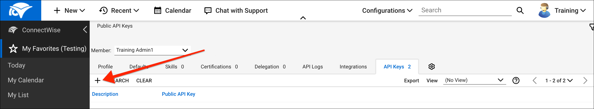

# API Provider Setup

To authenticate a {{page.heading}} element instance you must have an account and either generate or know your **Public Key** and **Private Key**.

__Note__: ConnectWise provides the most up-to-date and detailed setup instructions at [https://developer.connectwise.com/Manage/Developer_Guide](https://developer.connectwise.com/Manage/Developer_Guide).

To set up the endpoint:

1. Log in to your ConnectWise account.
2. Go to __My Account__.

3. Click the __API Keys__ tab.

4. Click the __+__ to generate a Public Key and Private Key.

10. Copy your Public Key and Private Key. These will be used to authenticate your element with ConnectWise.

Next [authenticate with ConnectWise to create an element instance](authenticate.html).
