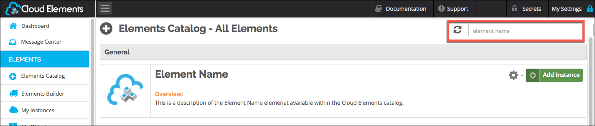

## Authenticate with {{page.heading}}

You can authenticate with {{page.heading}} to create your own instance of the {{page.heading}} element through the UI or through APIs. Once authenticated, you can use the element instance to access the different functionality offered by the {{page.heading}} platform.



## Authenticate Through the UI

Use the UI to authenticate with {{page.heading}} and create an element instance. {{page.heading}} authentication follows the typical OAuth 2 framework and you will need to sign in to {{page.heading}} as part of the process.

If you are configuring events, see the [Events section](events.html).

To authenticate an element instance:

1. Sign in to Cloud Elements, and then search for the element in our Elements Catalog.

    | Latest UI | Earlier UI  |
    | :------------- | :------------- |
    |    |    |

3. Create an authenticated element instance.

    | Latest UI | Earlier UI  |
    | :------------- | :------------- |
    | Hover over the element card, and then click __Create Instance__.</br>   | Click __Add Instance__.</br>   |

5. Enter a name for the element instance.
6. Select an **Authentication Type**:
  * Choose **Custom** to authenticate through user name and password.
  * Choose **oauth2** to authenticate using the key and client id that you identified in [Service Provider Setup](#setup.html).
6. Enter the parameters required by your selected authorization type. See [Custom Parameters](#custom-parameters) or [OAuth2 Parameters](#oauth2-parameters)for details.
7. Click __Create Instance__ (latest UI) or __Next__ (earlier UI).
8. Optionally add tags in the earlier UI:
     1. On the Tag It page, enter any tags that might help further define the instance.
      * To add more than one tag, click __Add__ after each tag.
      
     1. Click __Done__.
9. Note the **Token** and **ID** and save them for all future requests using the element instance.
1. Take a look at the documentation for the element resources now available to you.

## Authenticate Through API

You can provision the instance using [custom authentication](#custom-authentication) or [OAuth](#oauth-authentication).

### Custom Authentication

Use the `/instances` endpoint to authenticate with {{page.heading}} and create an element instance. If you are configuring events, see the [Events section](events.html).



To create an element instance:

1. Construct a JSON body as shown below (see [Custom Parameters](#custom-parameters)):

    ```json
            {
              "element": {
                "key": "{{page.elementKey}}"
              },
              "configuration": {
                "user.username": "<USERNAME>",
                "user.password": "<PASSWORD>",
                "dynamics.tenant": "yourcompanyname.crm.dynamics.com"
              },
              "tags": [
                "<Add_Your_Tag>"
              ],
              "name": "<INSTANCE_NAME>"
            }
    ```

1. Call the following, including the JSON body you constructed in the previous step:

        POST /instances

    

9. Note the **Token** and **ID** and save them for all future requests using the element instance.

### Custom Authentication Example cURL

```bash
curl -X POST \
  https://api.cloud-elements.com/elements/api-v2/instances \
  -H 'authorization: User <USER_SECRET>, Organization ,ORGANIZATION_SECRET>' \
  -H 'content-type: application/json' \
  -d '{
    "element": {
      "key": "dynamicscrmadfs"
    },
    "configuration": {
      "user.username": "xxxxxxxxxxxxxxxxxx",
      "user.password": "xxxxxxxxxxxxxxxxxxxxxx",
      "dynamics.tenant": "yourcompanyname.crm.dynamics.com"
    },
    "tags": [
      "Test"
    ],
    "name": "DynamicsCRMInstance"
  }'
```
## Custom Parameters

API parameters not shown in {{site.console}} are in `code formatting`.



| Parameter | Description   | Data Type |
| :------------- | :------------- | :------------- |
| `key` | The element key.<br>{{page.elementKey}}  | string  |
| Name</br>`name` |  The name for the element instance created during authentication.   | string  |
| User Name</br>`user.username` | The USERNAME of the Dynamics CRM account  | string |
| User password</br>`user.password` | The PASSWORD of the Dynamics CRM account  | string |
| Dynamics CRM URL</br>`dynamics.tenant` | The Microsoft Dynamics Tenant URL. | string |
| `tags` | *Optional*. User-defined tags to further identify the instance. | string |

## Example Response

```json
{
    "id": 123,
    "name": "DynamicsCRMInstance",
    "token": "xxxxxxxxxxxxxxxxxx",
    "element": {
        "id": 39,
        "name": "Microsoft Dynamics CRM",
        "key": "dynamicscrmadfs",
        "description": "Add a Microsoft Dynamics CRM Instance to connect your existing Microsoft Dynamics CRM\naccount (Online or On Premise) to the CRM Hub, allowing you to manage contacts, leads, accounts, opportunities etc. across multiple CRM Elements. You will need your Microsoft Dynamics CRM account information to add an instance.",
        "active": true,
        "deleted": false,
        "typeOauth": true,
        "trialAccount": false,
        "configDescription": "Microsoft Dynamics CRM For Online and On Premise",
    },
    "provisionInteractions": [],
    "valid": true,
    "disabled": false,
    "maxCacheSize": 0,
    "cacheTimeToLive": 0,
    "eventsEnabled": false,
    "cachingEnabled": false
}
```

### OAuth Authentication

Authenticating through API is a multi-step process that involves:

* [Getting a redirect URL](#getting-a-redirect-url). This URL sends users to the vendor to log in to their account.
* [Authenticating users and receiving the authorization grant code](#authenticating-users-and-receiving-the-authorization-grant-code). After the user logs in, the vendor makes a callback to the specified url with an authorization grant code.
* [Authenticating the element instance](#authenticating-the-element-instance). Using the authorization code from the vendor, authenticate with the vendor to create an element instance at Cloud Elements.

### Getting a Redirect URL

Use the following API call to request a redirect URL where the user can authenticate with the vendor. Replace `{keyOrId}` with the element key, `{{page.elementKey}}`.

```bash
GET /elements/{keyOrId}/oauth/url?apiKey=<api_key>&apiSecret=<api_secret>&callbackUrl=<url>
```

#### Query Parameters

| Query Parameter | Description   |
| :------------- | :------------- |
| apiKey | The key obtained from registering your app with the provider. This is the **Client ID** that you noted at the end of the [Service Provider Setup section](setup.html).  |
| apiSecret |  The client secret obtained from registering your app with the provider.  This is the **Client Secret** that you noted at the end of the [Service Provider Setup section](setup.html).   |
| callbackUrl | The URL that will receive the code from the vendor to be used to create an element instance. This is the **Callback URL** that you noted at the end of the [Service Provider Setup section](setup.html).  |
| siteAddress | The Microsoft Dynamics Tenant URL.  |

#### Example cURL

```bash
curl -X GET
-H 'Content-Type: application/json'
'https://api.cloud-elements.com/elements/api-v2/elements/{{page.elementKey}}/oauth/url?apiKey=fake_api_key&apiSecret=fake_api_secret&callbackUrl=https://www.mycoolapp.com/auth&siteAddress=&siteAddress=yourcompanyname.crm.dynamics.com&state={{page.elementKey}}'
```

#### Example Response

Use the `oauthUrl` in the response to allow users to authenticate with the vendor.

```json
{
"element": "{{page.elementKey}}",
"oauthUrl": "https://login.microsoftonline.com/common/oauth2/authorize?response_type=code&redirect_uri=https%3A%2F%2Fmycoolapp.com%2Fauth&state={{page.elementKey}}&client_id=1234567890"
}
```

### Authenticating Users and Receiving the Authorization Grant Code

Provide the response from the previous step to the users. After they authenticate, {{page.heading}} provides the following information in the response:

* code
* state

| Response Parameter | Description   |
| :------------- | :------------- |
| code | The Authorization Grant Code required by Cloud Elements to retrieve the OAuth access and refresh tokens from the endpoint.|
| state | A customizable identifier, typically the element key (`{{page.elementKey}}`) . |



### Authenticating the Element Instance

Use the `/instances` endpoint to authenticate with {{page.heading}} and create an element instance. If you are configuring events, see the [Events section](events.html).



To create an element instance:

1. Construct a JSON body as shown below (see [OAuth2 Parameters](#oauth2-parameters)):

    ```json
            {
              "element": {
                "key": "{{page.elementKey}}"
              },
              "providerData": {
                "code": "<AUTHORIZATION_GRANT_CODE>"
              },
              "configuration": {
                "oauth.api.key": "<CLIENT_ID>",
                "oauth.api.secret": "<CLIENT_SECRET>",
                "oauth.callback.url": "<CALLBACK_URL>",
                "dynamics.tenant": "yourcompanyname.crm.dynamics.com"
              },
              "tags": [
                "<Add_Your_Tag>"
              ],
              "name": "<INSTANCE_NAME>"
            }
    ```

1. Call the following, including the JSON body you constructed in the previous step:

        POST /instances

    

9. Note the **Token** and **ID** and save them for all future requests using the element instance.

#### OAuth2 Example cURL

```bash
curl -X POST \
  https://api.cloud-elements.com/elements/api-v2/instances \
  -H 'authorization: User <USER_SECRET>, Organization ,ORGANIZATION_SECRET>' \
  -H 'content-type: application/json' \
  -d '{
    "element": {
      "key": "dynamicscrmadfs"
    },
    "providerData": {
      "code": "8aa74ff8ae16ba3ca19d12cbdea83aff16bddcd7"
    },
    "configuration": {
      "oauth.api.key": "xxxxxxxxxxxxxxxxxx",
      "oauth.api.secret": "xxxxxxxxxxxxxxxxxxxxxx",
      "dynamics.tenant": "yourcompanyname.crm.dynamics.com"
      "oauth.callback.url": "https://mycoolapp.com"
    },
    "tags": [
      "Test"
    ],
    "name": "DynamicsCRMInstance"
  }'
```
## Parameters

API parameters not shown in {{site.console}} are in `code formatting`.



| Parameter | Description   | Data Type |
| :------------- | :------------- | :------------- |
| `key` | The element key.<br>{{page.elementKey}}  | string  |
| Name</br>`name` |  The name for the element instance created during authentication.   | string  |
| `oauth.callback.url` | The Callback URL  for the connected app you created for {{page.heading}}. This is the Callback URL that you noted at the end of the [Service Provider Setup section](setup.html).  |
| OAuth Client ID in Azure AD</br>`oauth.api.key` | The key obtained from registering your app with the provider. This is the **Client ID** that you noted at the end of the [Service Provider Setup section](setup.html). |  string |
| OAuth Client Secret in Azure AD</br> `oauth.api.secret` | The client secret obtained from registering your app with the provider.  This is the **Client Secret** that you noted at the end of the [Service Provider Setup section](setup.html).| string |
| `dynamics.tenant` | The Microsoft Dynamics Tenant URL. | string |
| `tags` | *Optional*. User-defined tags to further identify the instance. | string |

## Example Response

```json
{
    "id": 123,
    "name": "DynamicsCRMInstance",
    "token": "xxxxxxxxxxxxxxxxxx",
    "element": {
        "id": 39,
        "name": "Microsoft Dynamics CRM",
        "key": "dynamicscrmadfs",
        "description": "Add a Microsoft Dynamics CRM Instance to connect your existing Microsoft Dynamics CRM\naccount (Online or On Premise) to the CRM Hub, allowing you to manage contacts, leads, accounts, opportunities etc. across multiple CRM Elements. You will need your Microsoft Dynamics CRM account information to add an instance.",
        "active": true,
        "deleted": false,
        "typeOauth": true,
        "trialAccount": false,
        "configDescription": "Microsoft Dynamics CRM For Online and On Premise",
    },
    "provisionInteractions": [],
    "valid": true,
    "disabled": false,
    "maxCacheSize": 0,
    "cacheTimeToLive": 0,
    "eventsEnabled": false,
    "cachingEnabled": false
}
```
