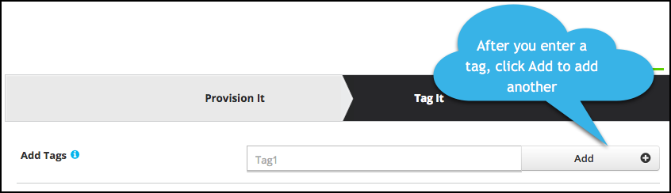

# Events

Cloud Elements supports events via polling or webhooks depending on the endpoint. If you would like to see more information on our Events framework, please see the [Event Management Guide](/docs/platform/event-management/index.html).



## Supported Events and Resources

Cloud Elements supports polling events for {{page.heading}}. Polling can be set up for one specific resource (i.e. `accounts`) or for multiple resources.

You can set up events for the following resources:

* accounts
* contacts
* leads
* opportunities
* tasks
* notes
* activities



## Polling

You can configure polling through the UI or in the JSON body of the `/instances` API call.




### Configure Polling Through the UI

To set up polling when creating an authenticated instance:

1. Complete the Configuration section as described in [Authenticate](authenticate.html)
2. Switch **Events Enabled** on.
3. Add an **Event Notification Callback URL**.
4. Optionally enter an **Event Notification Signature Key**.
4. Use the __Event poller refresh interval (mins)__ slider or enter a number in minutes to specify how often Cloud Elements should poll for changes.
5. Select and configure the resources to poll.

    | Latest UI | Earlier UI  |
    | :------------- | :------------- |
    | Select the resources to poll. </br>Optionally, click the pencil icon to further configure polling. | Edit the JSON to add or remove resources and optionally change the `datesConfiguration`.  |

7. Click __Create Instance__ (latest UI) or __Next__ (earlier UI).
8. Optionally add tags in the earlier UI:
     1. On the Tag It page, enter any tags that might help further define the instance.
      * To add more than one tag, click __Add__ after each tag.
      
     1. Click __Done__.
9. Note the **Token** and **ID** and save them for all future requests using the element instance.
8. Take a look at the documentation for the element resources now available to you.

### Configure Polling Through API

Use the `/instances` endpoint to authenticate with {{page.heading}} and create an element instance with polling enabled.

```json
{
  "event.notification.enabled": "true",
  "event.notification.callback.url": "<INSERT_YOUR_APPS_CALLBACK_URL>",
  "event.poller.configuration": "<SEE_BELOW>"
}
```



Here is an example instance JSON with polling events enabled for Microsoft Dynamics 2016 and later:

## Example

```json
{
  "element": {
    "key": "dynamicscrmadfs"
  },
  "configuration": {
    "user.username": "<INSERT_DYNMAICS_CRM_USERNAME>",
    "user.password": "<INSERT_DYNMAICS_CRM_PASSWORD>",
    "dynamics.tenant": "yourcompanyname.crm.dynamics.com",
    "event.notification.enabled": "true",
    "event.notification.callback.url": "<INSERT_YOUR_APPS_CALLBACK_URL>",
    "event.poller.configuration": {
      "accounts": {
        "url": "/hubs/crm/accounts?where=fetchChanges='true'",
        "idField": "id",
        "datesConfiguration": {
          "updatedDateField": "attributes.modifiedon",
          "updatedDateFormat": "milliseconds",
          "createdDateField": "attributes.createdon",
          "createdDateFormat": "milliseconds"
        }
      },
      "contacts": {
        "url": "/hubs/crm/contacts?where=fetchChanges='true'",
        "idField": "id",
        "datesConfiguration": {
          "updatedDateField": "attributes.modifiedon",
          "updatedDateFormat": "milliseconds",
          "createdDateField": "attributes.createdon",
          "createdDateFormat": "milliseconds"
        }
      },
      "opportunities": {
        "url": "/hubs/crm/opportunities?where=fetchChanges='true'",
        "idField": "id",
        "datesConfiguration": {
          "updatedDateField": "attributes.modifiedon",
          "updatedDateFormat": "milliseconds",
          "createdDateField": "attributes.createdon",
          "createdDateFormat": "milliseconds"
        }
      },
      "leads": {
        "url": "/hubs/crm/leads?where=fetchChanges='true'",
        "idField": "id",
        "datesConfiguration": {
          "updatedDateField": "attributes.modifiedon",
          "updatedDateFormat": "milliseconds",
          "createdDateField": "attributes.createdon",
          "createdDateFormat": "milliseconds"
        }
      },
      "tasks": {
        "url": "/hubs/crm/tasks?where=fetchChanges='true'",
        "idField": "id",
        "datesConfiguration": {
          "updatedDateField": "attributes.modifiedon",
          "updatedDateFormat": "milliseconds",
          "createdDateField": "attributes.createdon",
          "createdDateFormat": "milliseconds"
        }
      },
      "notes": {
        "url": "/hubs/crm/notes?where=fetchChanges='true'",
        "idField": "id",
        "datesConfiguration": {
          "updatedDateField": "attributes.modifiedon",
          "updatedDateFormat": "milliseconds",
          "createdDateField": "attributes.createdon",
          "createdDateFormat": "milliseconds"
        }
      },
      "activities": {
        "url": "/hubs/crm/activities?where=fetchChanges='true'",
        "idField": "id",
        "datesConfiguration": {
          "updatedDateField": "attributes.modifiedon",
          "updatedDateFormat": "milliseconds",
          "createdDateField": "attributes.createdon",
          "createdDateFormat": "milliseconds"
        }
      }
    }
  },
  "tags": [
    "<INSERT_TAGS>"
  ],
  "name": "<INSERT_INSTANCE_NAME>"
}
```

Here is an example instance JSON with polling events enabled for earlier versions of Microsoft Dynamics:

```json
{
  "element": {
    "key": "dynamicscrmadfs"
  },
  "configuration": {
    "user.username": "<INSERT_DYNMAICS_CRM_USERNAME>",
    "user.password": "<INSERT_DYNMAICS_CRM_PASSWORD>",
    "dynamics.tenant": "yourcompanyname.crm.dynamics.com",
    "event.notification.enabled": "true",
    "event.notification.callback.url": "<INSERT_YOUR_APPS_CALLBACK_URL>",
    "event.poller.configuration": {
      "accounts": {
        "url": "/hubs/crm/accounts?where=modifiedon >'${gmtDate:yyyy-MM-dd'T'HH:mm:ss'Z'}'",
        "idField": "id",
        "datesConfiguration": {
        "updatedDateField": "attributes.modifiedon",
        "updatedDateFormat": "milliseconds",
        "createdDateField": "attributes.createdon",
        "createdDateFormat": "milliseconds"
        }
      },
      "contacts": {
        "url": "/hubs/crm/contacts?where=modifiedon >'${gmtDate:yyyy-MM-dd'T'HH:mm:ss'Z'}'",
        "idField": "id",
        "datesConfiguration": {
        "updatedDateField": "attributes.modifiedon",
        "updatedDateFormat": "milliseconds",
        "createdDateField": "attributes.createdon",
        "createdDateFormat": "milliseconds"
        }
      },
      "opportunities": {
        "url": "/hubs/crm/opportunities?where=modifiedon >'${gmtDate:yyyy-MM-dd'T'HH:mm:ss'Z'}'",
        "idField": "id",
        "datesConfiguration": {
        "updatedDateField": "attributes.modifiedon",
        "updatedDateFormat": "milliseconds",
        "createdDateField": "attributes.createdon",
        "createdDateFormat": "milliseconds"
        }
      },
      "leads": {
        "url": "/hubs/crm/leads?where=modifiedon >'${gmtDate:yyyy-MM-dd'T'HH:mm:ss'Z'}'",
        "idField": "id",
        "datesConfiguration": {
        "updatedDateField": "attributes.modifiedon",
        "updatedDateFormat": "milliseconds",
        "createdDateField": "attributes.createdon",
        "createdDateFormat": "milliseconds"
        }
      },
      "tasks": {
        "url": "/hubs/crm/tasks?where=modifiedon >'${gmtDate:yyyy-MM-dd'T'HH:mm:ss'Z'}'",
        "idField": "id",
        "datesConfiguration": {
        "updatedDateField": "attributes.modifiedon",
        "updatedDateFormat": "milliseconds",
        "createdDateField": "attributes.createdon",
        "createdDateFormat": "milliseconds"
        }
      },
      "notes": {
        "url": "/hubs/crm/notes?where=modifiedon >'${gmtDate:yyyy-MM-dd'T'HH:mm:ss'Z'}'",
        "idField": "id",
        "datesConfiguration": {
        "updatedDateField": "attributes.modifiedon",
        "updatedDateFormat": "milliseconds",
        "createdDateField": "attributes.createdon",
        "createdDateFormat": "milliseconds"
        }
      },
      "activities": {
        "url": "/hubs/crm/activities?where=modifiedon >'${gmtDate:yyyy-MM-dd'T'HH:mm:ss'Z'}'",
        "idField": "id",
        "datesConfiguration": {
        "updatedDateField": "attributes.modifiedon",
        "updatedDateFormat": "milliseconds",
        "createdDateField": "attributes.createdon",
        "createdDateFormat": "milliseconds"
        }
      }
    }
  },
  "tags": [
    "<INSERT_TAGS>"
  ],
  "name": "<INSERT_INSTANCE_NAME>"
}
```

Please note that when creating an instance via the APIs with Polling configuration, the double quotes will need to be escaped and it should not contain any new line characters. The above examples have omitted this formatting for readability.
