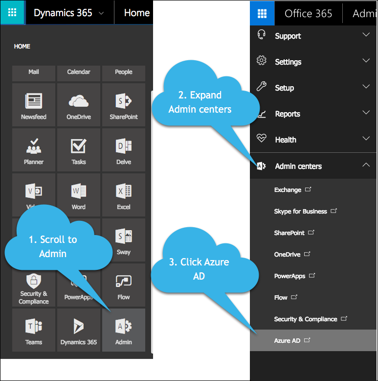
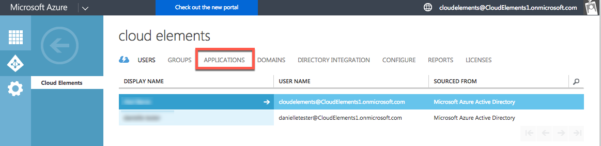
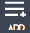

## API Provider Setup

To set up the Microsoft Dynamics CRM endpoint, you need to have an account and create or already have an app. Also, to authenticate with OAuth 2, you need to know the Client ID and keys for the app. If you use custom authentication when you provision an element, you do not need the Client ID and keys for the app.
Dynamics versions 2013-2015 are supported by the MS Dynamics 2015 SDK.

__Note__: Microsoft provides the most up-to-date and detailed setup instructions at [Microsoft Dynamics 365 Web API](https://msdn.microsoft.com/en-us/library/mt593051.aspx).

To create an app and acquire OAuth information:

1. Log in to your MS Dynamics account.
1. Navigate to the Admin Center, expand __Admin Centers__, and then click __Azure AD__.

    

1. Select your directory, and then click __Applications__.

    

2. Select your application from the list, or create a new application (click  in the page footer).
3. Complete the configuration, paying close attention to the following for OAuth authentication:
  * __keys__: Use the key value  when you provision an element using OAuth authentication as the __OAuth Client Secret in Azure AD__ or `oauth.api.secret`.
  * __CLIENT ID__:  Used when you provision an element using OAuth authentication as the __OAuth Client ID in Azure AD__ or `oauth.api.key`.
  * __permissions to other applications__: Permissions shown when you provison an instance with OAuth authentication.

     __Note:__ The key value for __OAuth Client Secret in Azure AD__ appears only after you save the configuration and only one time. You will not be able to retrieve the key value later, so capture it immediately after you save.

4. Click  in the page footer.
1. Go to the __keys__ section and capture the key value for __OAuth Client Secret in Azure AD__.

Next [authenticate an element instance with {{page.heading}}](authenticate.html).
