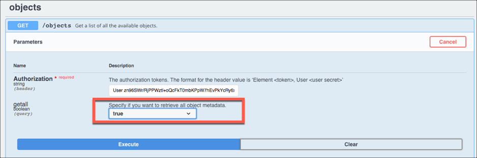

# Tips

The Tips section includes more information about the element including FAQs, endpoint limitations, and general tips.



## Objects

Although not all entities are documented in the [API docs](api-documentation.html), all entities are available. To get a list of entities call:

```bash
GET /objects
```
Use the list to make calls to any of the entities, for example:

```bash
GET /contract
GET /customeraddress
GET /account
GET /sharepointdocumentlocation
```

Not seeing a custom object? See below.

## Custom Objects

When you make a `GET /objects` request Microsoft Dynamics does not include custom objects in the response. You can include custom objects by adding the query parameter `?getall=true`. In the API Docs, change the **getall** field to true.

### Example http Request

```bash
https://api.cloud-elements.com/elements/api-v2/hubs/crm/objects?getall=true
```

### Example API Docs


## Searching

You can search on almost any attribute. However, we recommend that you keep your searches as simple as possible. Cloud Elements normalizes the proprietary FetchXML queries used by MS Dynamics, simplifying their verbose query language.

## Metadata

MS Dynamics provides rich metadata. Make sure that you call `GET /objects/{objectName}/metadata` and review the metadata.

## On Premise Authentication

For on-premise authentication, we support Federated, but not Active Directory.
