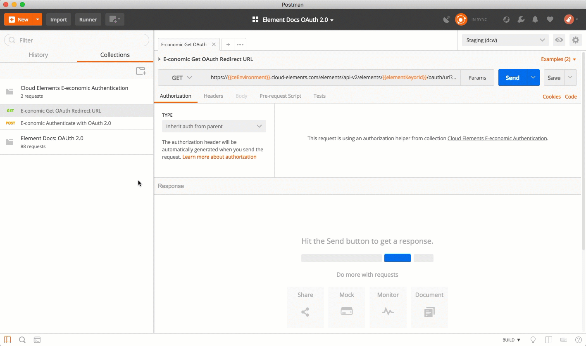

# Authenticate with {{page.apiProvider}}

You can authenticate with {{page.apiProvider}} to create your own instance of the {{page.heading}} element through the UI or through APIs. Once authenticated, you can use the element instance to access the different functionality offered by the {{page.apiProvider}} platform.



## Authenticate Through the UI

Use the UI to authenticate with {{page.apiProvider}} and create a {{page.heading}} element instance.  {{page.apiProvider}} authentication follows the typical OAuth 2.0 framework and you will need to sign in to {{page.apiProvider}} as part of the process.

If you are configuring events, see the [Events section](events.html).

To authenticate an element instance:

1. Sign in to Cloud Elements, and then search for {{page.heading}} in our Elements Catalog.

4. Hover over the element card, and then click **Authenticate**.

5. Enter a name for the element instance.
6. Enter {{page.apiKey}} and {{page.apiSecret}}.
9. Optionally type or select one or more Element Instance Tags to add to the authenticated element instance.
7. Click **Create Instance**.
8. Log in to {{page.apiProvider}}, and then allow the connection.

After successfully authenticating, we give you several options for next steps. [Make requests using the API docs](https://docs.cloud-elements.com/home/view-element-api-docs) associated with the instance, [map the instance to a virtual data resource](https://docs.cloud-elements.com/home/common-object), or [use it in a formula template](https://docs.cloud-elements.com/home/formula-template).

## Authenticate Through API

Authenticating through API is similar to authenticating via the UI. Instead of clicking and typing through a series of buttons, text boxes, and menus, you will instead send a request to our `/instances` endpoint. The end result is the same, though: an authenticated element instance with a  **token** and **id**.

To help you authenticate using our APIs, try the Run in Postman button below. After you import the collection, take a look at the docs.

<div>

</div>



Authenticating through API follows a multi-step OAuth 2.0 process that involves:



* [Getting a redirect URL](#getting-a-redirect-url). This URL sends users to the vendor to log in to their account.
* [Authenticating users and receiving the authorization grant code](#authenticating-users-and-receiving-the-authorization-grant-code). After the user logs in, the vendor makes a call back to the specified url with an authorization grant code.
* [Authenticating the element instance](#authenticating-the-element-instance). Using the authorization code from the vendor, authenticate with the vendor to create an element instance at Cloud Elements.

### Getting a Redirect URL



Use the following API call to request a redirect URL where the user can authenticate with the service provider. Replace `{keyOrId}` with the element key, `{{page.elementKey}}`.

```bash
curl -X GET /elements/{keyOrId}/oauth/url?apiKey=<{{page.apiProvider}} {{page.apiKey}}>&apiSecret=<{{page.apiProvider}} {{page.apiSecret}}> &callbackUrl=<your callback URL>
```

#### Query Parameters

| Query Parameter | Description   |
| :------------- | :------------- |
| apiKey |  {{site.data.glossary.element-auth-api-key}} This is the **{{page.apiKey}}** that you recorded in [API Provider Setup](setup.html). |
| apiSecret |    {{site.data.glossary.element-auth-api-secret}} This is the **{{page.apiSecret}}** that you recorded in [API Provider Setup](setup.html).  |
| callbackUrl |   {{site.data.glossary.element-auth-oauth-callback}} This is the **{{page.callbackURL}}** that you recorded in [API Provider Setup](setup.html)   |

#### Example Request

```bash
curl -X GET \
'https://api.cloud-elements.com/elements/api-v2/elements/{{page.elementKey}}/oauth/url?apiKey=Rand0MAP1-key&apiSecret=fak3AP1-s3Cr3t&callbackUrl=https:%3A%2F%2Fwww.mycoolapp.com%2auth' \
```

#### Example Response

Use the `oauthUrl` in the response to allow users to authenticate with the vendor.

```json
{
    "oauthUrl": "https://secure.e-conomic.com/secure/api1/requestaccess.aspx?appPublicToken={{page.apiKey}}&redirecturl={{page.apiSecret}}",
    "element": "economic"
}
```

### Authenticating Users and Receiving the Authorization Grant Code



Provide the `oauthUrl` in the response from the previous step to the users. After users authenticate, {{page.apiProvider}} provides the following information in the response:

* code
* state

| Response Parameter | Description   |
| :------------- | :------------- |
| code | {{site.data.glossary.element-auth-grant-code}} |
| state | {{site.data.glossary.element-auth-state}} (`{{page.elementKey}}`) . |



### Authenticating the Element Instance



Use the `code` from the previous step and the `/instances` endpoint to authenticate with {{page.apiProvider}} and create an element instance. If you are configuring events, see the [Events section](events.html).



To authenticate an element instance:

1. Construct a JSON body as shown below (see [Parameters](#parameters)):


    ```json
    {
      "element": {
        "key": "{{page.elementKey}}"
      },
      "providerData": {
        "code": "<AUTHORIZATION_GRANT_CODE>"
      },
      "configuration": {
        "oauth.api.key": "<{{page.apiProvider}} app {{page.apiKey}}>",
      	"oauth.api.secret": "<{{page.apiProvider}} app {{page.apiSecret}}>",
        "oauth.callback.url": "<Your App's {{page.callbackURL}} >"
      },
      "tags": [
        "<Add_Your_Tag>"
      ],
      "name": "<INSTANCE_NAME>"
    }
    ```

1. Call the following, including the JSON body you constructed in the previous step:

        POST /instances

    

1. Locate the `token` and `id` in the response and save them for all future requests using the element instance.

#### Example Request

```bash
curl -X POST \
  https://api.cloud-elements.com/elements/api-v2/instances \
  -H 'authorization: User <USER_SECRET>, Organization <ORGANIZATION_SECRET>' \
  -H 'content-type: application/json' \
  -d '{
  "element": {
    "key": "{{page.elementKey}}"
  },
  "providerData": {
    "code": "xxxxxxxxxxxxxxxxxxxxxxx"
  },
  "configuration": {
    "oauth.api.key": "Rand0MAP1-key",
    "oauth.api.secret": "fak3AP1-s3Cr3t",
    "oauth.callback.url": "https;//mycoolapp.com"
  },
  "tags": [
    "Docs"
  ],
  "name": "API Instance"
}'
```
## Authentication Parameters

API parameters in the UI are **bold**, while parameters available in the instances API are in `code formatting`.



| Parameter | Description   | Data Type |
| :------------- | :------------- | :------------- |
| `key` | The element key.<br>{{page.elementKey}}  | string  |
| `code` | {{site.data.glossary.element-auth-grant-code}} | string |
|  **Name**</br>`name` |  {{site.data.glossary.element-auth-name}}  | string  |
| `oauth.api.key` |  {{site.data.glossary.element-auth-api-key}} This is the **{{page.apiKey}}** that you noted in [API Provider Setup](setup.html). |  string |
| `oauth.api.secret` | {{site.data.glossary.element-auth-api-secret}} This is the **{{page.apiSecret}}** that you noted in [API Provider Setup](setup.html). | string |
| `oauth.callback.url` | {{site.data.glossary.element-auth-oauth-callback}} This is your app's **{{page.callbackURL}}**.  | string |
| Tags</br>`tags` | {{site.data.glossary.element-auth-tags}} | string |

## Example Response for an Authenticated Element Instance

In this example, the instance ID is `12345` and the instance token starts with "ABC/D...". The actual values returned to you will be unique: make sure you save them for future requests to this new instance.

```json
{
  "id": 84975,
  "name": "API Instance 1",
  "createdDate": "2018-03-21T16:57:00Z",
  "token": "{{elementInstanceToken}}",
  "element": {
      "id": 11005,
      "name": "E-conomic",
      "key": "economic",
      "description": "Add a E-conomic Instance to connect your existing E-conomic account to the ERP Hub, allowing you to manage all of your ERP activities across multiple ERP Elements. You will need your E-conomic account information to add an instance.",
      "image": "https://images.cloudelements.io/2743_2743_e-conomic-logo201712051817.png",
      "active": true,
      "deleted": false,
      "typeOauth": false,
      "trialAccount": false,
      "resources": [ ],
      "transformationsEnabled": true,
      "bulkDownloadEnabled": true,
      "bulkUploadEnabled": true,
      "cloneable": true,
      "extendable": true,
      "beta": false,
      "authentication": {
          "type": "oauth2"
      },
      "extended": false,
      "hub": "erp",
      "protocolType": "http",
      "parameters": [  ]
      "private": false
  },
  "elementId": 11005,
  "tags": [
      "Docs"
  ],
  "provisionInteractions": [],
  "valid": true,
  "disabled": false,
  "maxCacheSize": 0,
  "cacheTimeToLive": 0,
  "providerData": {
      "code": "{{providerData.code}}"
  },
  "configuration": {    },
  "eventsEnabled": false,
  "traceLoggingEnabled": false,
  "cachingEnabled": false,
  "externalAuthentication": "none",
  "user": {
      "id": 123456,
      "emailAddress": "claude.elements@cloud-elements.com",
      "firstName": "Claude",
      "lastName": "Elements"
    }
}
```
