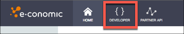

# API Provider Setup

To authenticate a {{page.heading}} element instance you must register an app with {{page.apiProvider}}. When you authenticate, use the **{{page.apiSecret}}** and **{{page.apiKey}}** as the (`oauth.api.key`) ,  AND (`oauth.api.secret`).

If you've already set up an app and just need to know how to find your **{{page.apiKey}}** and **{{page.apiSecret}}**, see [Locate Credentials for Authentication](#locate-credentials-for-authentication). If you need to register an app, see [Create an Application](#create-an-application).

See the latest setup instructions in the [{{page.apiProvider}} documentation](https://www.e-conomic.com/developer/authentication).



## Locate Credentials for Authentication

If you already created an application, follow the steps below to locate the **{{page.apiKey}}** and **{{page.apiSecret}}**. If you have not created an app, see [Create an Application](#create-an-application).

To find your OAuth 2.0 credentials:

1. Log in to your account at [{{page.apiProvider}}](https://login.e-conomic.com/global#_ga=2.13357687.1959920065.1521645272-1178512842.1521645272).
2. Click the Developer tab.

3. Record the **{{page.apiKey}}** and **{{page.apiSecret}}**.

## Create an Application

If you have not created an application, you need one to authenticate with {{page.apiProvider}}.

To create an application:

1. Log in to your account at [{{page.apiProvider}}](https://login.e-conomic.com/global#_ga=2.13357687.1959920065.1521645272-1178512842.1521645272).
2. Click the Developer tab.

4. Click **New app**.
5. Enter a name and select the roles that you want to grant to users authenticating with E-conomic.
6. Click **Save**.
3. Record the **{{page.apiKey}}** and **{{page.apiSecret}}**.

Next [authenticate an element instance with {{page.apiProvider}}](authenticate.html).
