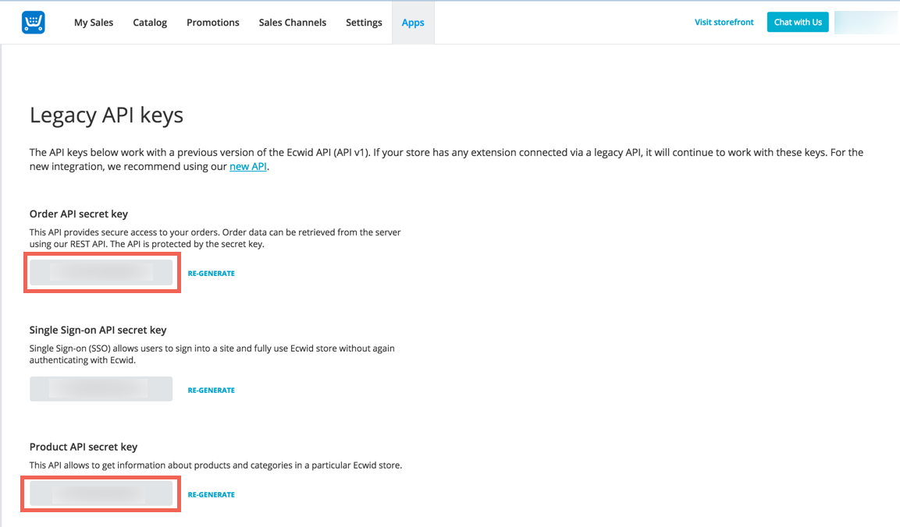
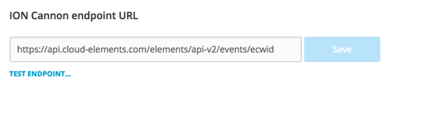

## Events



Cloud Elements supports webhook events for Ecwid.

### Webhooks

Follow these steps to set up a new Ecwid Application for API integration. Via a web browser go to: [https://my.ecwid.com/cp/#register](https://my.ecwid.com/cp/#register) and sign up. It must be a paid account.

Once setup, please login.

1. Make note of your Store ID as it will be needed to provision an Element Instance.


2. Next the Legacy API keys will need to be retrieved.  In order to do retrieve them, you must be logged in to your store then navigate to a Legacy API Key URL

__NOTE:  Your store ID is required in the Legacy API Key URL - replace `INSERT_STORE_ID` in the URL with your actual store ID.__

Legacy API Key URL (Don't forget to insert your store ID):

`https://my.ecwid.com/store/INSERT_STORE_ID#legacy_api`

Copy the Order and Product API secrets


If you wish to add event functionality then please enter the following URL in the ION Cannon endpoint URL: `https://api.cloud-elements.com/elements/api-v2/events/ecwid`


Ecwid Orders are currently supported within the Events Framework.

In order to enable webhooks, add these two extra configurations to your instance JSON:

```
"event.notification.enabled": "true",
"event.notification.callback.url": "<INSERT_YOUR_APPS_CALLBACK_URL>"
```

instance JSON with webhook events enabled:

```json
{
  "element": {
    "key": "ecwid"
  },
  "configuration": {
    "ecwid.order.key": "<INSERT_API_ORDER_SECRET>",
    "ecwid.product.key": "<INSERT_API_PRODUCT_KEY>",
    "ecwid.store.id": "<INSERT_STORE_ID>",
    "event.notification.enabled": "true",
    "event.notification.callback.url": "<INSERT_YOUR_APPS_CALLBACK_URL>"
  },
  "tags": [
    "<Add_Your_Tag>"
  ],
  "name": "<Insert_Instance_Name>"
}
```
