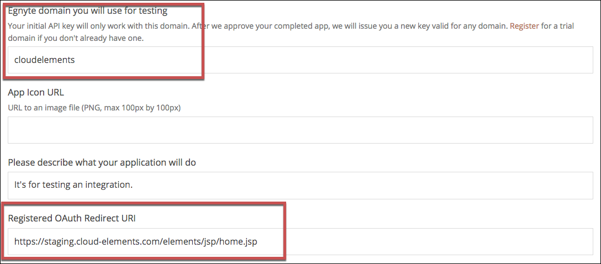
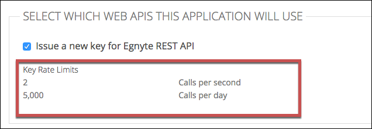

# API Provider Setup

To authenticate a {{page.heading}} element instance you must register an app with {{page.heading}} and know the **Key**, **Shared Secret**, and **Registered OAuth Redirect URI** of the app. You use these when you authenticate an element instance as the API Key, API Secret, and OAuth Callback URL.

To set up the API provider:

1. Log in to your developer account at [Egnyte](https://developers.egnyte.com).
3. Click **Create New Application**.
4. Complete the required information.
5. In **Egnyte domain you will use for testing** enter the domain that you have access to for testing. When you authenticate an element instance, you also provide an Egnyte domain. When testing, these values should match.
5. In **Registered OAuth Redirect URI** enter the URL that you will use as the OAuth Callback URL when you authenticate an element instance.

3. Record your **Registered OAuth Redirect URI** as the OAuth Callback URL.
2. In the SELECT WHICH WEB APIS THIS APPLICATION WILL USE section, note the rate limits.

2. Click **Register Application**.
3. Record the **Key** and **Shared Secret** as your API Key and API Secret.

Next [authenticate an element instance with {{page.heading}}](authenticate.html).
