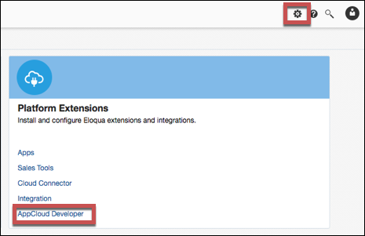
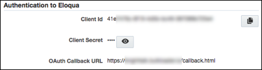

# API Provider Setup

To authenticate a {{page.heading}} element instance you must register an app with {{page.heading}}. When you authenticate, use the **Client ID**, **Client Secret**, and **OAth Callback URL** as the **API Key**, **API Secret**, and **Callback URL**.

See the latest setup instructions in the [{{page.heading}} documentation](http://docs.oracle.com/cloud/latest/marketingcs_gs/OMCAB/#Developers/GettingStarted/Authentication/authenticate-using-oauth.htm%3FTocPath%3DGetting%2520started%2520with%2520Oracle%2520Eloqua%2520APIs%7CAuthentication%7C_____2).



## Locate Credentials for Authentication

If you already created an application, see below to locate the **Client ID**, **Client Secret**, and **OAuth Callback URL**. If you have not created an app, see [Create an Application](#create-an-application).

To find your OAuth 2.0 credentials:

1. Log in to your developer account at [{{page.heading}}](http://www.eloqua.com/).
2. Click **Settings**, and then click **AppCloud Developer**.

2. Click the application that you want to connect.
3. Scroll down to the Authentication to Eloqua section.
3. Record the **API Client ID**, **API Client Secret**, and  **OAth Callback URL** for your app.

## Create an Application

If you have not created an application, you need one to authenticate with {{page.heading}}.

To create an application:

1. Log in to your developer account at [{{page.heading}}](http://www.eloqua.com/).
2. Click **Settings**, and then click **AppCloud Developer**.

2. Click **Create App**.
3. Complete the required New App section: **Name**, **Description**, and **Icon**.
4. Complete the Lifecycle Setup section.
5. In the Authentication to Eloqua section, enter the OAuth Callback URL needed for authentication with your app via OAuth 2.0.
6. Click **Save**.
3. Scroll down to the Authentication to Eloqua section.
3. Record the **API Client ID**, **API Client Secret**, and  **OAth Callback URL** for your app.

Next [authenticate an element instance with {{page.heading}}](authenticate.html).
