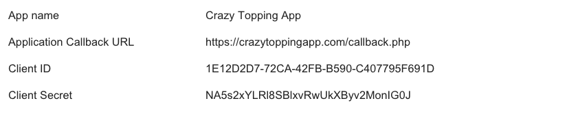

## Endpoint Setup

Follow these instructions to create a new ePages Connected App.
Register as a developer: [http://www.epages.cloud/developer/](http://www.epages.cloud/developer/)

1. Within the administration area of your test shop, click the tab Apps & Themes. In the drop down menu, choose the field Developer apps.

2. In the Developer apps view, click the button Add.

3. Fill out the input field App name. Specify the Application Callback URL. Make sure the URL is https and publicly accessible. Note: HTTP Application Callback URLs can be used for developer apps, but you need to provide an HTTPS URL once you want to submit the app to the App Store. Once the input fields are filled out, click the button Generate access data.

4. You will be assigned a Client ID, a Client Secret as well as an Access token. The Access token is granted by your test shop, so that you can start accessing the ePages API immediately.

You may view the [ePages docs](https://developer.epages.com/apps/create-app) for more detailed information.

The application Access Token and your store URL are needed for provisioning.

Next [create an instance](epages-create-instance.html).
