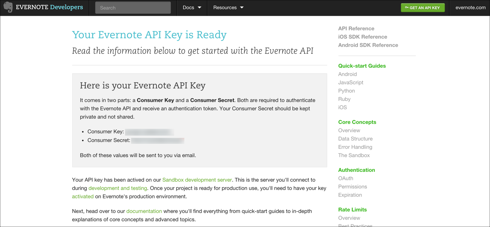

# API Provider Setup

To authenticate an {{page.heading}} element instance you must register an app with {{page.apiProvider}}. When you authenticate, use the **{{page.apiKey}}** and **{{page.apiSecret}}** as the **Evernote OAuth API Key** and **Evernote OAuth API Secret**.

See the latest setup instructions in the [{{page.apiProvider}} documentation](https://dev.evernote.com/doc/#start).

To get your API keys:

1. Log in to your account at [{{page.apiProvider}}](https://apiprovider.com).
1. Click **GET AN API KEY**.

2. Complete the request form.
3. In **API Permissions**, select **Full Access**.
4. Click **Request Key**.
3. Record the **{{page.apiKey}}** and **{{page.apiSecret}}**.

Next [authenticate an element instance with {{page.apiProvider}}](authenticate.html).
