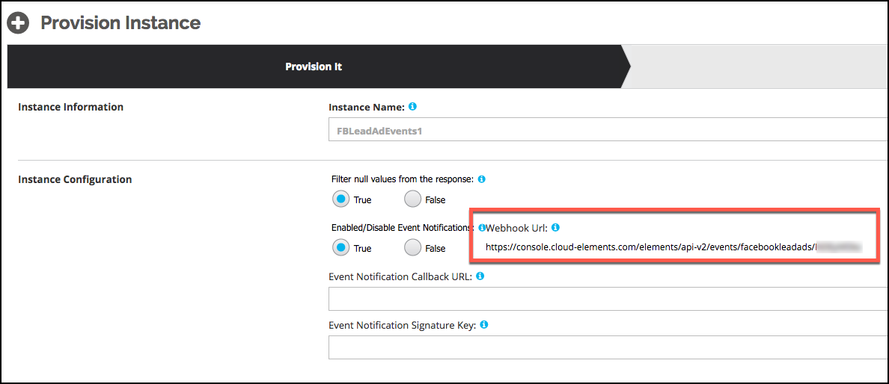
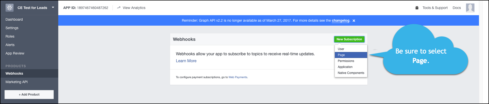
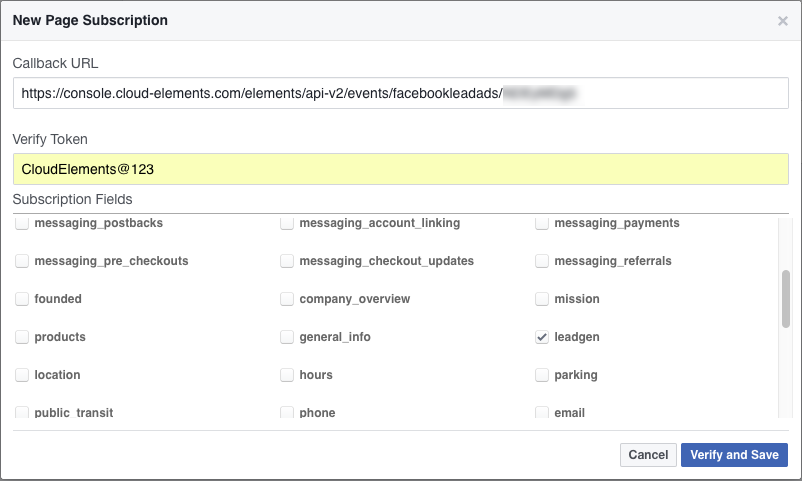

## Events



### Set Up Events for Facebook Lead Ads

The Facebook Lead Ads element supports webhooks for Lead Generation events. For Facebook Lead Ads events to work with Cloud Elements, use the `Webhook URL` created after provisioning to set up the Webhook product in Facebook. See [the Facebook webhook documentation](https://developers.facebook.com/docs/marketing-api/guides/lead-ads/retrieving/v2.8) for more information about how Facebook uses webhooks.

### Get the Webhook URL

You need the `Webhook URL` which is dynamically created when you provision an element. To locate the `Webhook URL`, navigate to the Element Instance in the user interface.



### Event Endpoint Setup

To set up webhooks for Facebook Lead Ads:

1. Log in to your Facebook Lead Ads developer account at [https://developers.facebook.com/](https://developers.facebook.com/).
1. Navigate to your Facebook App.
1. Click __Create App ID__.
1. On the Product Setup page, locate Webhooks, and then click __Get Started__.
1. Click __New Subscription__, and then select __Page__.
  
1. On the New Page Subscription window, enter the following:
  * __Callback URL__: Enter the `Webhook URL` from the Element Instance. See [Get the Webhook URL](#get-the-webhook-url).
  * __Verify Token__: Enter "CloudElements@123".
1. In Subscription Fields, select __leadgen__.

    The New Page Subscription Window should look like this:
    
1. Click __Verify and Save__.

### Set up the Element Instance

To enable events, add these extra configurations to your instance JSON. Only `event.notification.enabled` is required.

```bash
"event.notification.enabled": "true",
"event.notification.callback.url": "<INSERT_YOUR_APPS_CALLBACK_URL>",
"event.notification.signature.key":"<INSERT_YOUR_APP_ID>"
```

instance JSON with polling events enabled:

```json
{
  "element": {
    "key": "facebookleadads"
  },
  "providerData": {
    "code": "Code on Return the URL"
  },
  "configuration": {
    "oauth.api.key": "<INSERT_FACEBOOK_CLIENT_ID>",
    "oauth.api.secret": "<INSERT_FACEBOOK_CLIENT_SECRET>",
    "oauth.callback.url": "https://www.mycoolapp.com/auth",
    "oauth.scope": "<INSERT_FACEBOOK_LEVEL_OF_PERMISSION>" ,
    "event.notification.enabled": "true",
    "event.notification.callback.url": "<INSERT_YOUR_APPS_CALLBACK_URL>",
    "event.notification.signature.key":"<INSERT_YOUR_APP_ID>"
  },
  "tags": [
    "<INSERT_TAGS>"
  ],
  "name": "<INSERT_INSTANCE_NAME>"
}
```

__Note__: For webhooks, enter at least "manage_pages" for `oauth.scope`.
