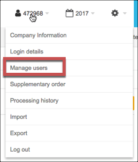

# API Provider Setup

To authenticate a {{page.heading}} element instance you must use the **Client Secret** associated with your app and the **Authorization Code** of your integration.

See the latest setup instructions in the [{{page.heading}} documentation](https://developer.fortnox.se/documentation/general/authentication/).

1. Complete the [New Integration form](https://developer.fortnox.se/new-integration/).
2. Record the **Client-Secret** that Fortnox provides.
3. [Publish the integration](https://developer.fortnox.se/publish-integration/) to make it available to your customers.
4. Log in to Fortnox account and then select **Manage Users** from the profile list.

5. At the bottom of the page, click **Add Integration** and locate your integration by Client ID.
6. After you connect, record the API code. This is the **Authorization Code** needed to authenticate.

You can use each authorization code only once and must generate a new one for each authenticated element instance.

Next [authenticate an element instance with {{page.apiProvider}}](authenticate.html).
