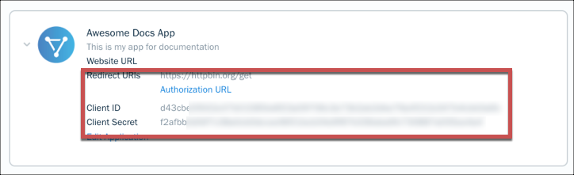

# API Provider Setup

To authenticate a {{page.heading}} element instance you must register an app with {{page.apiProvider}}. When you authenticate, use the **{{page.apiKey}}**, **{{page.apiSecret}}**, and **{{page.callbackURL}}** as the **API Key**, **API Secret**, and **Callback URL**.  You will also need to provide a Company Name.

If you've already set up an app and just need to know how to find your **{{page.apiKey}}**, **{{page.apiSecret}}**, and **{{page.callbackURL}}**, see [Locate Credentials for Authentication](#locate-credentials-for-authentication). If you need to register an app, see [Create an Application](#create-an-application).

See the latest setup instructions in the [{{page.apiProvider}} documentation](https://www.freshbooks.com/api/authentication).



## Locate Credentials for Authentication

If you already created an application, follow the steps below to locate the **{{page.apiKey}}**, **{{page.apiSecret}}**, and **{{page.callbackURL}}**. If you have not created an app, see [Create an Application](#create-an-application).

To find your OAuth 2.0 credentials:

1. Log in to your account at [{{page.apiProvider}}](https://my.freshbooks.com/#/developer).
2. Click the application that you want to connect.
3. Record the **{{page.apiKey}}**, **{{page.apiSecret}}**, and **{{page.callbackURL}}**.

## Create an Application

If you have not created an application, you need one to authenticate with {{page.apiProvider}}.

To create an application:

1. Log in to your account at [{{page.apiProvider}}](https://my.freshbooks.com/#/developer).
2. Click **Create an App**.
3. Complete the required information.
4. Click **Save**.
3. Record the **{{page.apiKey}}**, **{{page.apiSecret}}**, and **{{page.callbackURL}}**.

Next [authenticate an element instance with {{page.apiProvider}}](authenticate.html).
