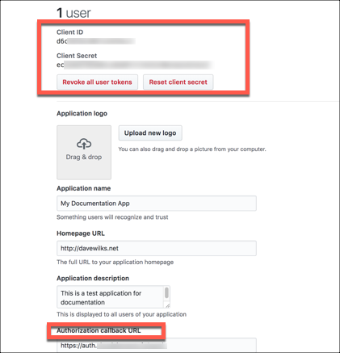

# API Provider Setup

To authenticate a {{page.heading}} element instance you must register an app with {{page.apiProvider}}. When you authenticate, use the **{{page.apiKey}}**, **{{page.apiSecret}}**, and **{{page.callbackURL}}** as the **API Key** (`oauth.api.key`), **API Secret** (`oauth.api.secret`), and **Callback URL** (`oauth.callback.url`).

In addition, you also need to know the organization and repository that you want to connect to.

If you've already set up an app and just need to know how to find your **{{page.apiKey}}** and **{{page.apiSecret}}**, see [Locate Credentials for Authentication](#locate-credentials-for-authentication). If you need to register an app, see [Create an Application](#create-an-application).

See the latest setup instructions in the [{{page.apiProvider}} documentation](https://developer.github.com/apps/building-oauth-apps/creating-an-oauth-app/).



## Locate Credentials for Authentication

If you already created an application, follow the steps below to locate the **{{page.apiKey}}**, **{{page.apiSecret}}**, and **{{page.callbackURL}}**. If you have not created an app, see [Create an Application](#create-an-application).

To find your OAuth 2.0 credentials:

1. Log in to your account at [{{page.apiProvider}}](https://github.com).
2. In the upper-right corner of any page, click your profile photo, then click **Settings**.
3. In the left sidebar, click **Developer settings**.
4. Select your authorized app.
3. Record the **{{page.apiKey}}**, **{{page.apiSecret}}**, and **{{page.callbackURL}}** for your app.

## Create an Application

If you have not created an application, you need one to authenticate with {{page.apiProvider}}.

To create an application:

1. Log in to your account at [{{page.apiProvider}}](https://github.com).
2. 2. In the upper-right corner of any page, click your profile photo, then click **Settings**.
3. In the left sidebar, click **Developer settings**.
2. Click **Click New OAuth App**. If you haven't created an app before, this button will say, Register a new application.
3. Complete the required information.
4. Click **Register application**.
3. Record the **{{page.apiKey}}**, **{{page.apiSecret}}**, and **{{page.callbackURL}}** for your app.

Next [authenticate an element instance with {{page.apiProvider}}](authenticate.html).
