# API Provider Setup

To authenticate a {{page.heading}} element instance you must create a project with a web application in the Google API console. After you create the project and app, {{page.apiProvider}} provides a **{{page.apiKey}}** and **{{page.apiSecret}}** which you will use to [authenticate an element instance](authenticate.html). You'll also need the **{{page.callbackURL}}** that you configure while creating the app.

When you set up your app, you must also enable the following Google APIs:

* Google People API
* GMail API
* Google Calendar API

If you've already set up an app and just need to know how to find your **{{page.apiKey}}** and **{{page.apiSecret}}**, see [Locate Credentials for Authentication](#locate-credentials-for-authentication). If you need to create a project and register an app, see [Create an Application](#create-an-application).

See the latest setup instructions in the [Google API documentation](https://support.google.com/googleapi/answer/7015000?hl=en&ref_topic=7014522&authuser=0).



## Locate Credentials for Authentication

If you already created a project and application, follow the steps below to locate the **{{page.apiKey}}**, **{{page.apiSecret}}**, and **{{page.callbackURL}}**. If you have not created an app, see [Create an Application](#create-an-application).



To find your OAuth 2.0 credentials:

1. Log in to your account at [{{page.apiProvider}}](https://console.developers.google.com/apis/dashboard).
2. Click **Select a project**, choose your project from the list, and then click **Open**.
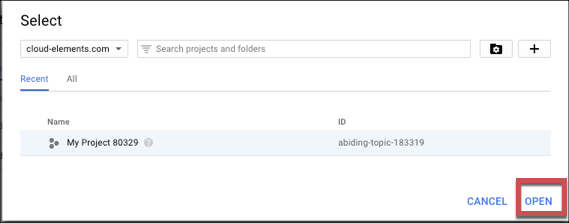

    Google displays your apps and associated **{{page.apiKey}}**.

3. Click the pencil icon to see the **{{page.apiKey}}**, **{{page.apiSecret}}**, and **{{page.callbackURL}}**.
3. Record the **{{page.apiKey}}** and **{{page.apiSecret}}**.
3. Record the **{{page.callbackURL}}** for your app.
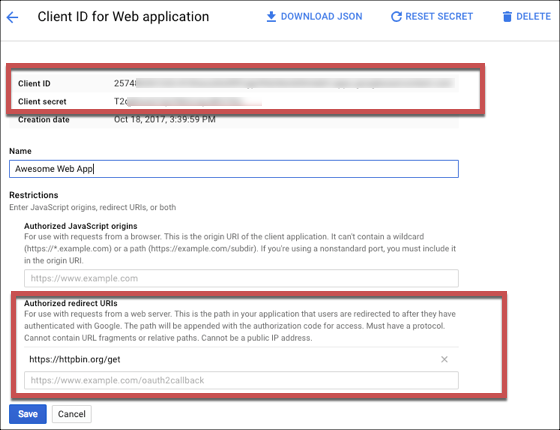

## Create an Application

If you have not already created a project and application, you need one to authenticate with {{page.apiProvider}}. Creating an application is a multi-step process:

1. [Create a project](#create-a-project)
2. [Enable APIs](#enable-apis)
3. [Create a web application](#create-a-web-application)

### Create a Project

To create a project:

1. Log in to your account at [{{page.apiProvider}}](https://console.developers.google.com/apis/dashboard).
2. Click **Select a project** and click the **Create Project** button.
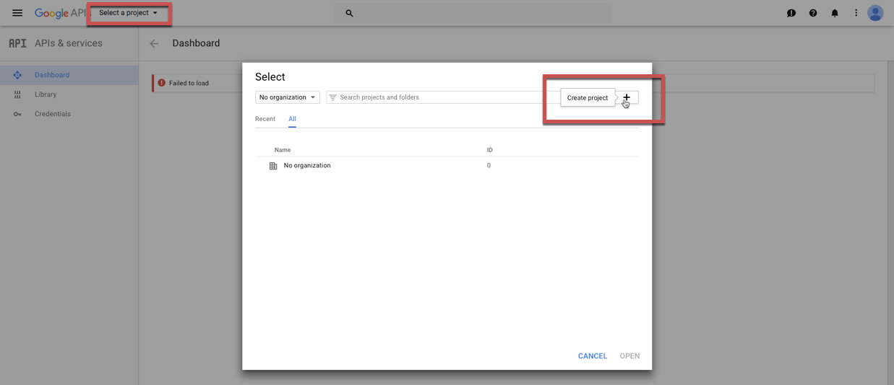
3. Accept the terms of service.
3. Complete the required information (Project Name, email updates, and the Terms of Service).
4. Click **Create**.
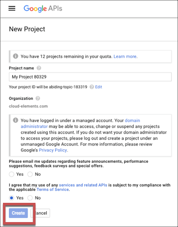

### Enable APIs

To make all of the requests available in the {{page.heading}} element, you must enable the following APIs

* Google People API
* GMail API
* Google Calendar API

To enable APIs:

5. Select the project that you just created
6. Click **Enable APIs and Services**.
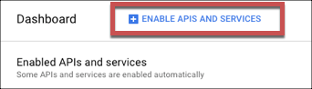
7. Search for and enable the Google People API, GMail API, and Google Calendar API.
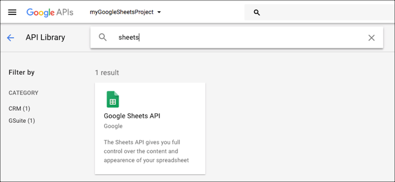

### Create a Web Application

8. Click **Credentials** on the left menu.
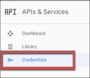
9. Click the **OAuth consent screen** tab.
10. Enter a Product Name and add any optional information, and then click **Save**.
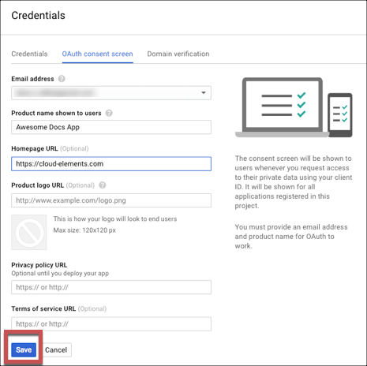
9. Click **Create Credentials**, and then select **OAuth Client ID**.
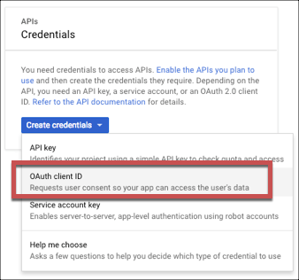
10. Select **Web application** as the Application type.
11. Enter a **Name** and the **{{page.callbackURL}}** for your app. Record this as the OAuth Callback URL that you will need to authenticate.
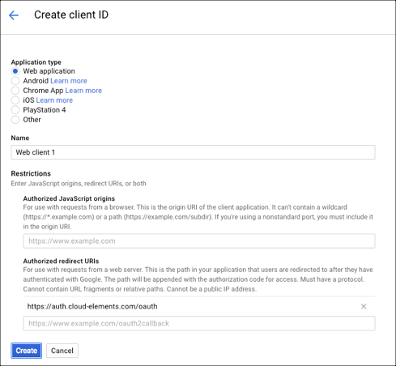
4. Click **Create**.
3. Record the **{{page.apiKey}}** and **{{page.apiSecret}}** to use when you authenticate.
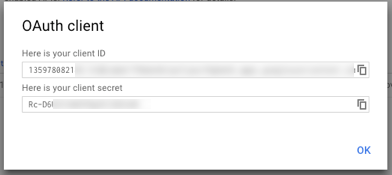

Next [authenticate an element instance with Google Suite](authenticate.html).
