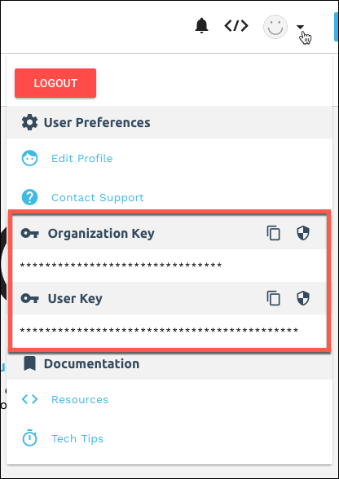
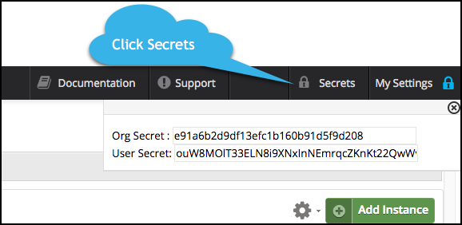

# Welcome to the {{page.heading}} Element

{{page.heading}} provides Cloud Storage services.



## Element Details

| Element Information | Details     |
| :------------- | :------------- |
| API Documentation | [Google Drive API documentation](https://developers.google.com/drive/v3/reference/) |
| Authentication | OAuth 2  |
| Events | Webhooks |
| Bulk | Not Supported |
| Transformations | Not Supported |
| Rate Limits | [{{page.heading}} rate limit quotas can be seen in your specific Google App under "quotas"](https://console.developers.google.com/iam-admin/quotas)|
| Authentication Requirements |  None |

## Base URL

The Cloud Element Base URL for all API calls is `https://api.cloud-elements.com/elements/api-v2`.

HTTP requests to the REST API are protected with HTTP Basic authentication with your Organization and User secret and an Element token. We use many standard HTTP features, like HTTP verbs, understood by most HTTP clients. JSON is returned in all responses from the API, including errors. The APIs have predictable, straightforward URLs and use HTTP response codes to indicate API errors.

## Authenticating with Cloud Elements

To authenticate with Cloud Elements, you need to know your Organization Secret and User Secret. When making some calls, you also need to know the Element Token.

When you create an account with us, we assign you an Organization Secret and a User Secret. An Organization is a customer of Cloud Elements (`/organizations`). The User and Organization secrets represent your account with Cloud Elements.

To find your Organization and User Secret:

| Latest UI | Earlier UI  |
| :------------- | :------------- |
| Open the profile menu.    | Click __Secrets__ in the header.    |

When you create a new connection to an endpoint, you will receive an Element token. After you create an instance, Cloud Elements automatically refreshes the token behind the scenes so that you won't need to connect your application again.

To find your Element token:

        GET /instances/<INSTANCE_ID>

An Element token and a User secret are required to execute one of our Hub API calls (e.g. `/hubs/documents/files` or `/hubs/crm/contacts`). For more information about Hubs, see [Hub API Docs](../../hubs/hub-docs)

Pass tokens and secrets as basic HTTP Header values.

* To make a Platform or API call, include the following in the header:

        Authorization: User <INSERT_USER_SECRET>, Organization <INSERT_USER_SECRET>

* To make a Hub API call, include the following in the header:

        Authorization: User <INSERT_USER_SECRET>, Organization <INSERT_USER_SECRET>, Element <INSERT_ELEMENT_TOKEN>



Get started by [setting up the service provider](setup.html).
