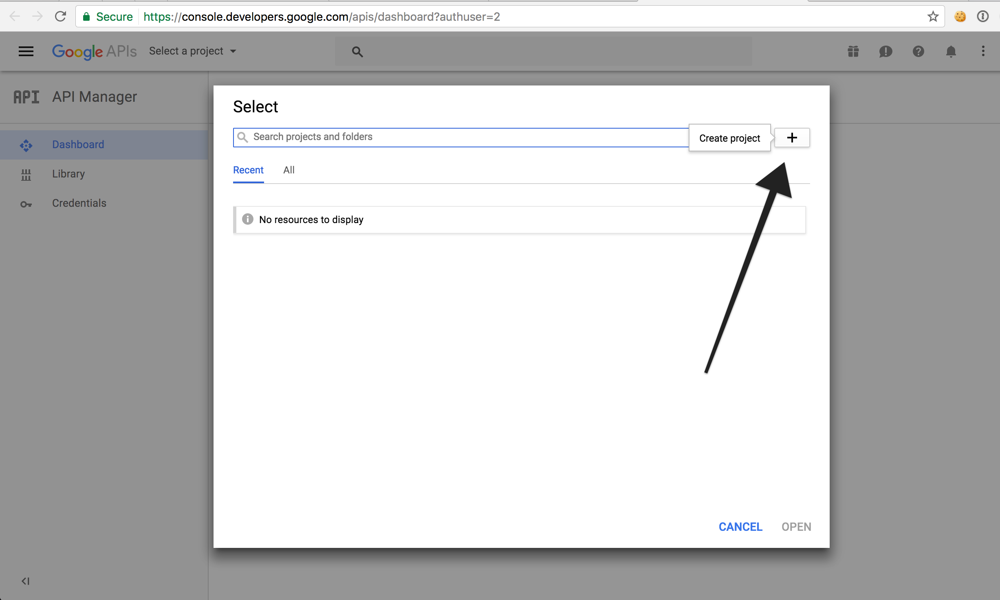
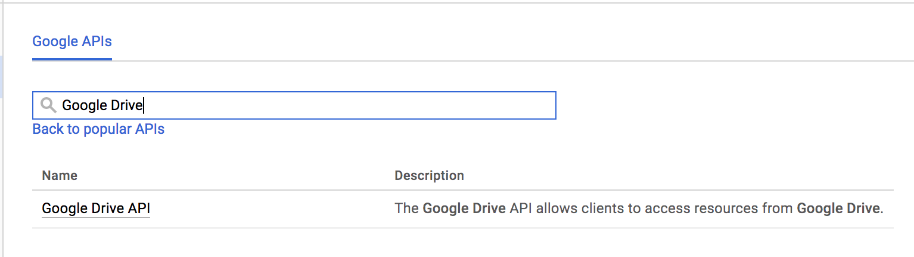
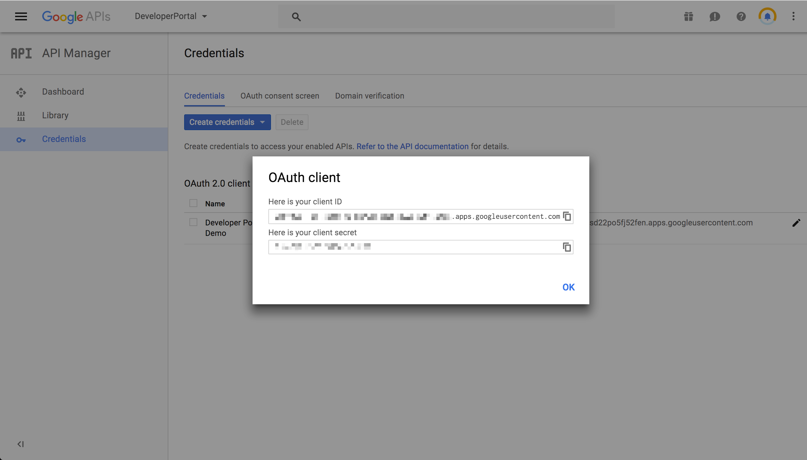

# API Provider Setup

To authenticate a {{page.heading}} element instance you must have a project withe the Google Drive API enabled.



To set up the API Provider:

1. Navigate to <a href=https://console.developers.google.com/apis/dashboard>your Google Drive developer dashboard</a> and select your Google Drive project.

    

    

1. Enable the Google Drive API for the project.  You are free to enable other APIs as well, but we require *at least* the Google Drive API.

1. After you enable the Google Drive API, click **Credentials** on the left-hand side ,and then click **Create credentials**.
2. Select **Web Application** as the **Application type** and follow the prompts.

    

1. Note the OAuth client secret and OAuth client ID, which you need to authenticate an element instance. 

Next [authenticate an element instance with Google Drive](authenticate.html).
