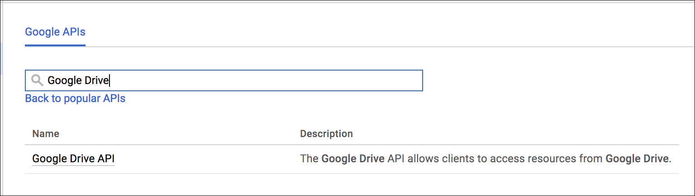

# Service Provider Setup



Navigate to <a href=https://console.developers.google.com/apis/dashboard>your Google Drive developer dashboard</a> and select your Google Drive project.  If you do not have any Google Drive projects, create a new one by clicking "Select a project" and then the "+": 

Once you have created, or selected, your Google Drive project, enable the Google Drive API for this project.  You are free to enable other APIs as well, but *at least* this API should be enabled. 

After the Google Drive API is enabled, click on "Credentials" on the left-hand side and then click "Create credentials".  Select "Web Application" as the "Application type" and follow the necessary prompts as necessary.  



Once you are finished, you will be given an OAuth client secret and OAuth client ID.  Take note of these, as they will be needed when creating a Google Drive Element Instance. 

Next [authenticate an element instance with Google Drive](authenticate.html).
