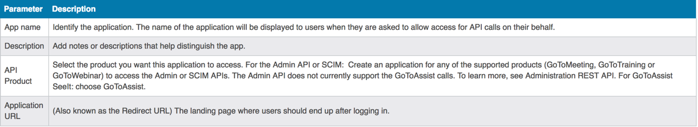

## Endpoint Setup

Follow these steps to set up a Citrix GoToWebinar application with the endpoint.

GoTo application APIs accessed through the Developer Center are authenticated first through an application. That application is a developer- and product-specific entity you define. This means, to access both GoToMeeting and GoToAssist APIs, you create two developer center applications. Once you have authenticated the application, you can obtain an access token and authenticate application users.

1 - Register for a GoTo developer account

Registration is required to access forums, submit support tickets, and create developer applications. It is not required to review the API documentation.

Go to https://developer.citrixonline.com and register.

2 - Have access to a GoTo account

The APIs that access GoTo products require user accounts. This set of steps assumes you will be making calls on behalf of registered users. You will provide the API interactions; they will log in to a GoTo application and run the interactions.

Alternately, or temporarily during development, you can set up free test accounts for yourself.

3 - Create a developer application

The External Developer Center uses OAuth 2.0 for authentication. Creating a developer application generates a Consumer Key. This is the Client ID in OAuth that you can use to identify the application.

* In the Internal Developer Center, click My Apps.
* The My Apps page displays. If you already have apps, they are listed here.
* To create a new app, click Add a new app on the My Apps page.

Enter the App data:

* Click Create App.
* Back in the My Apps page, open the new application.
* Copy the Consumer Key and Secret value

You can find more information on the GoToWebinar API in the [Citrix Documentation](https://developer.citrixonline.com/how-create-developer-app).

Next [create an instance](gotowebinar-create-instance.html).
