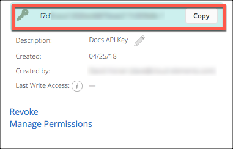

# API Provider Setup

To authenticate a {{page.heading}} element instance you must use the **{{page.username}}**  configured in {{page.apiProvider}}.

See the latest setup instructions in the [{{page.heading}} documentation](https://developers.greenhouse.io/harvest.html#authentication).

## Locate Your API Key

If you already created an API Key, follow the steps below to locate the **{{page.username}}**. If you have not created an API key, see [Create an API Key](#create-an-api-key).

1. Log in to your account at [{{page.heading}}](https://app.greenhouse.io).
2. Click the Settings icon at the top of the page, or click the **Configure** tab.
3. Open the Dev Center: click **Dev Center** in the list on the left or the link on the Configure page.
4. Click **API Credential Management**.
2. In the sidebar, click **Advanced Settings**, and then click **Legacy API Settings**.
3. Record the **{{page.username}}** .

## Create an API Key

If you have not created an API Key, you need one to authenticate with {{page.apiProvider}}.

To create an API Key:

1. Log in to your account at [{{page.heading}}](https://app.greenhouse.io).
2. Click the Settings icon at the top of the page, or click the **Configure** tab.
3. Open the Dev Center: click **Dev Center** in the list on the left or the link on the Configure page.
4. Click **API Credential Management**.
2. Click **Create New API Key**.
3. Enter a description, and then select **Harvest** from the **Type** list.
4. Click **Create**.
5. Select the permissions for the API key, and then click **Update**.

    

3. Record the **{{page.username}}** .

Next [authenticate an element instance with {{page.apiProvider}}](authenticate.html).
