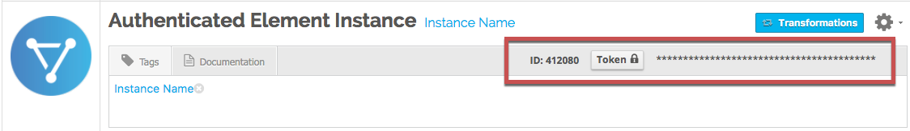

# Events

Cloud Elements supports events via polling or webhooks depending on the API provider. If you would like to see more information on our Events framework, please see the [Event Management Guide](/docs/platform/event-management/index.html).



## Supported Events and Resources

Cloud Elements supports webhook events for {{page.heading}}. For more information about webhooks at {{page.heading}} including the currently available webhooks, see [{{page.heading}}'s webhooks documentation](https://developer.hootsuite.com/v1.0/docs/webhooks-overview).

## Webhooks

You can configure webhooks [through the UI](#configure-webhooks-through-the-ui) or in the JSON body of the `/instances` [API request](#configure-webhooks-through-api) .

### Configure Webhooks Through the UI

For more information about each field described here, see [Parameters](#parameters).

To authenticate an element instance with webhooks:

1. Complete the authentication steps in [Authenticate with {{page.heading}}](authenticate.html#authenticate-through-the-ui).
2. Enable events: Switch **Events Enabled** on.

    | Latest UI | Earlier UI  |
    | :------------- | :------------- |
    | Switch **Events Enabled** on. </br>|  In **Event Notifications Enabled**, select **True**.</br> |

8. Add an **Event Notification Callback URL**.
9. In Cloud Elements 2.0, optionally type or select one or more tags to add to the authenticated element instance.
7. Click **Create Instance** (Cloud Elements 2.0) or **Next** (earlier UI).
8. Provide your {{page.heading}} credentials, and then allow the connection.

    After you authenticate with the API Provider, the authentication flow returns you to {{site.console}}.

8. If using the earlier UI, optionally add tags to the authenticated element instance.
9. Note the **Token** and **ID** and save them for all future requests using the element instance.

    | Cloud Elements 2.0 | Earlier UI  |
    | :------------- | :------------- |
    |  |   |

### Configure Webhooks Through API

Use the `/instances` endpoint to authenticate with {{page.heading}} and create an element instance with webhooks enabled.



To authenticate an element instance with webhooks:

1. Get an authorization grant code by completing the steps in [Getting a redirect URL](authenticate.html#getting-a-redirect-url) and  [Authenticating users and receiving the authorization grant code](authenticate.html#authenticating-users-and-receiving-the-authorization-grant-code).
1. Construct a JSON body as shown below (see [Parameters](#parameters)):

    ```json
    {
      "element": {
        "key": "{{page.elementKey}}"
      },
      "providerData": {
        "code": "<AUTHORIZATION_GRANT_CODE>"
      },
      "configuration": {
        "oauth.callback.url": "<CALLBACK_URL>",
        "oauth.api.key": "<CONSUMER_KEY>",
      	"oauth.api.secret": "<CONSUMER_SECRET>",
        "event.notification.enabled": true,
        "event.notification.callback.url": "<CALLBACK_URL>"
      },
      "tags": [
        "<Add_Your_Tag>"
      ],
      "name": "<INSTANCE_NAME>"
    }

    ```

1. Call the following, including the JSON body you constructed in the previous step:

        POST /instances

    

1. Locate the `token` and `id` in the response and save them for all future requests using the element instance.


#### Example cURL

```bash
curl -X POST \
  https://api.cloud-elements.com/elements/api-v2/instances \
  -H 'authorization: User <USER_SECRET>, Organization <ORGANIZATION_SECRET>' \
  -H 'content-type: application/json' \
  -d '{
  "element": {
    "key": "{{page.elementKey}}"
  },
  "providerData": {
    "code": "xoz8AFqScK2ngM04kSSM"
  },
  "configuration": {
    "oauth.callback.url": "https://mycoolapp.com",
    "oauth.api.key": "xxxxxxxxxxxxxxxxxx",
    "oauth.api.secret": "xxxxxxxxxxxxxxxxxxxxxx"
    "event.notification.enabled": true,
    "event.notification.callback.url": "https://mycoolapp.com/events"
  },
  "tags": [
    "Docs"
  ],
  "name": "API Instance"
}'
```

## Parameters

API parameters not shown in the {{site.console}} are in `code formatting`.

<add custom element-specific params at the bottom of the table>

| Parameter | Description   | Data Type |
| :------------- | :------------- | :------------- |
| `key` | The element key.<br>{{page.elementKey}}  | string  |
| `code` | The authorization grant code returned from the API provider in an OAuth 2.0 authentication workflow. | string |
|  Name</br>`name` |  The name for the element instance created during authentication.   | string  |
| `oauth.callback.url` | The URL where you want to redirect users after they grant access. This is the **API Callback URL** that you noted in the [API Provider Setup section](setup.html).  | string  |
| `oauth.api.key` | The REST API Client ID from {{page.heading}}. This is the **REST API Client ID** that you noted in the [API Provider Setup section](setup.html) |  string |
| `oauth.api.secret` | The REST API Client Secret from {{page.heading}}. This is the **REST API Client Secret** that you noted in the [API Provider Setup section](setup.html)| string |
| Events Enabled </br>`event.notification.enabled` | *Optional*. Identifies that events are enabled for the element instance.</br>Default: `false`.  | boolean |
| Event Notification Callback URL</br>`event.notification.callback.url` |  The URL where you want Cloud Elements to send the events. This is the **Webhook URL** that you noted in the [API Provider Setup section](setup.html) | string |
| tags | *Optional*. User-defined tags to further identify the instance. | string |
