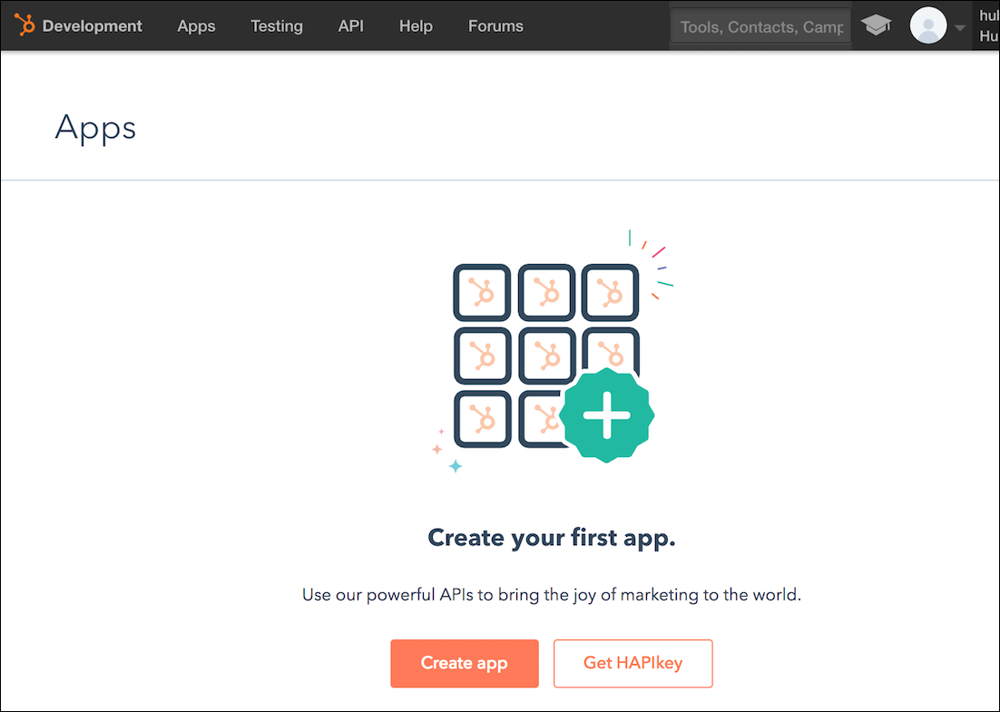
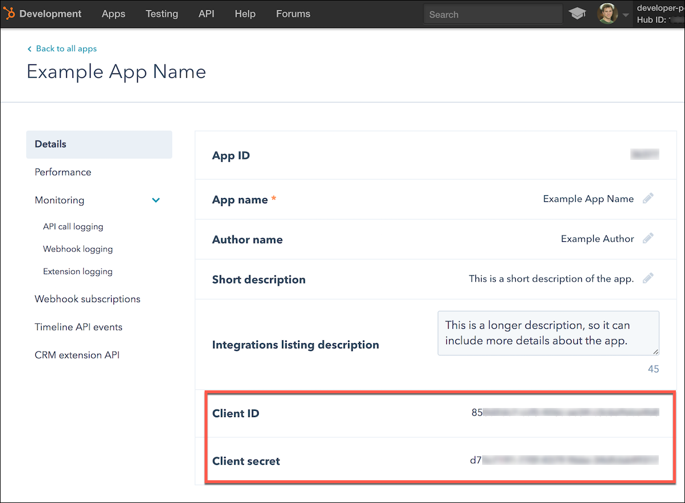

# Service Provider Setup

To create a custom {{page.heading}} integration you must have a {{page.heading}} developer account. If you do not have a developer account visit [https://app.hubspot.com/signup/developers](https://app.hubspot.com/signup/developers)

To set up the service provider:

1. Via a web browser, log in to your Hubspot account at [https://app.hubspot.com/login](https://app.hubspot.com/login).

    Once you login, you should land on the developer dashboard. If you are redirected elsewhere, navigate to the developer dashboard.

1. From the developer dashboard, click **Create App**.

1. Name your app, select public or private, and then click **Create**.
1. After creating your app, note the following.
 * Client Id
 * Client Secret

Next [authenticate an element instance with {{page.heading}}](authenticate.html).
