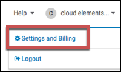
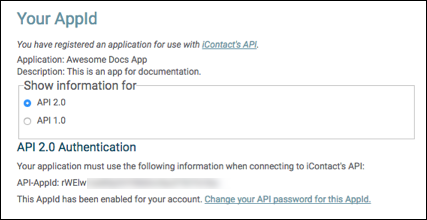
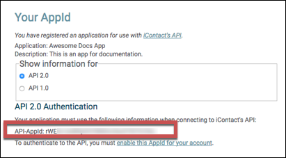

# API Provider Setup

To authenticate a {{page.heading}} element instance you must use information associated with the application that you registered with {{page.heading}}. When you authenticate, use your **{{page.username}}** and the **API version**, **API-AppID**,  and **{{page.password}}** from the application registered with {{page.heading}}. You will use these when you authenticate as the **API-Username**, **API-Version**, **AppId**, and **API-Password**.

See the latest setup instructions in the [{{page.heading}} documentation](https://www.icontact.com/developerportal/documentation/start-building).



## Locate Credentials for Authentication

If you already created an application, follow the steps below to locate the **API version**, **AppID**, and **{{page.password}}**. If you have not registered an app, see [Register an Application](#register-an-application).

To find your credentials:

1. Log in to your account at [{{page.heading}}](https://app.icontact.com).

    The **{{page.username}}** that you use to log in is used as the **API-Username** when you authenticate.

2. Click the account name on the top-right side, and then click **Settings and Billing**.

3. Click **iContact API** at bottom of the list.
4. Record the API version under **Show Information for**. This is used as the **API-Version** when you authenticate.
3. Record the **API-AppID**.
4. iContact does not show the API password. If you do not know it, create a new password.

## Register an Application

If you have not registered an application, you need one to authenticate with {{page.heading}}.

To register an application:

1. Log in to your account at [{{page.heading}}](https://app.icontact.com).
2. Click the account name on the top-right side, and then click **Settings and Billing**.

3. Click **iContact API** at bottom of the list.
4. Register an application: provide the Application Name and a Description.
2. Click **Get AppId**.
3. Record the **API-AppId**.

3. Click **enable this AppId for your account**.
4. Enter an **{{page.password}}**. Record the password for use as the API-Password when you authenticate.
4. Click **Save**.
