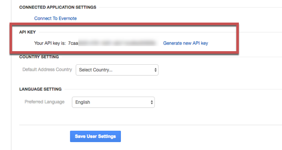

# API Provider Setup

To authenticate a {{page.heading}} element instance you must use the **{{page.username}}**  that you use to log in to {{page.heading}} and the **{{page.password}}**.

See the latest setup instructions in the [{{page.heading}} documentation](https://support.insight.ly/hc/en-us/articles/204864594-Finding-your-Insightly-API-key).

To find your credentials:

1. Log in to your account at [{{page.heading}}](https://nsightly.com).
2. Click your user profile in the top left, and then click **User Settings**.

    You should land on the User Settings page, but if not click **User Settings** just to the left of the main page.

2. Scroll to the bottom to find your API key.

Next [authenticate an element instance with {{page.apiProvider}}](authenticate.html).
