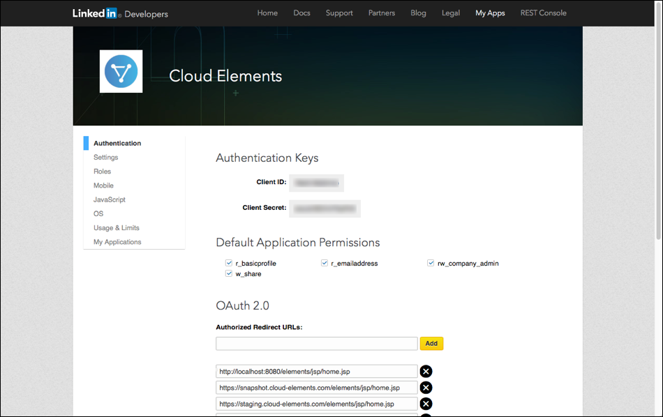

# API Provider Setup

To authenticate a {{page.heading}} element instance you must register an app with {{page.heading}}. When you authenticate, use the **{{page.apiKey}}**, **{{page.apiSecret}}**, and an **{{page.callbackURL}}** as the **API Key**, **API Secret**, and **Callback URL**.  Your app must include the correct permissions, including `rw_company_admin`

See the latest setup instructions in the [{{page.heading}} documentation](https://developer.linkedin.com/docs/oauth2).



## Locate Credentials for Authentication

If you already created an application, see below to locate the **{{page.apiKey}}**, **{{page.apiSecret}}**, and **{{page.callbackURL}}**. If you have not created an app, see [Create an Application](#create-an-application).

To find your OAuth 2.0 credentials:

1. Log in to your developer account at [{{page.heading}}](https://www.linkedin.com/developer/apps/).
2. Click the application that you want to connect.
3. Record the **{{page.apiKey}}** and **{{page.apiSecret}}**.
3. Record at least one of the **{{page.callbackURL}}s** for your app.



## Create an Application

If you have not created an application, you need one to authenticate with {{page.heading}}.

To create an application:

1. Log in to your developer account at [{{page.heading}}](https://www.linkedin.com/developer/apps/).
2. Click **Create Application**.
3. Complete the required information.
4. Click **Submit**.
5. Update the permissions. At a minimum, select `rw_company_admin`.
3. Record the **{{page.apiKey}}** and **{{page.apiSecret}}**.
3. Record at least one of the **{{page.callbackURL}}s** for your app.

Next [authenticate an element instance with {{page.heading}}](authenticate.html).
