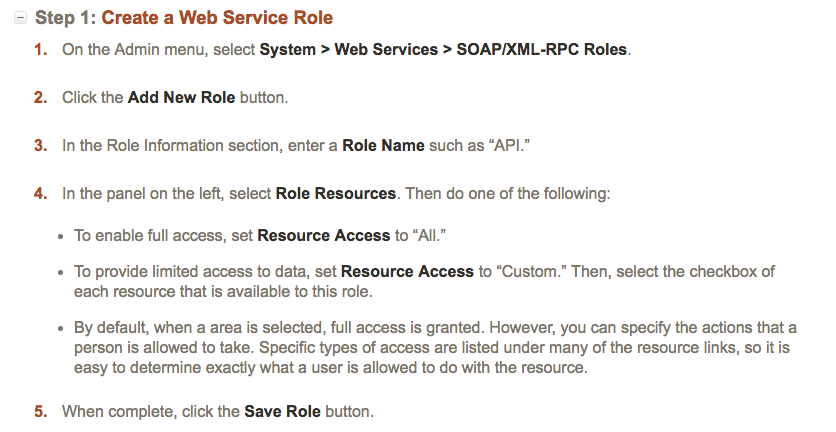
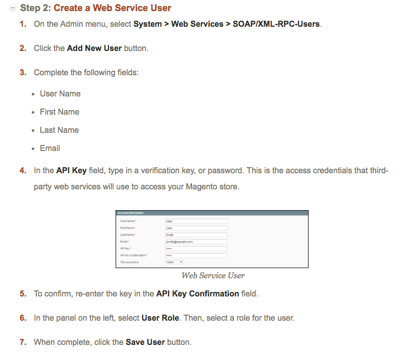

## Endpoint Setup

Activating Web Services

Web Services give you the ability to grant permission to third-party applications to access your store data for the purpose of integration. Magento Community Edition supports both SOAP and REST services.

For more information, please see the [Magento Developer docs](http://docs.magento.com/m1/ce/user_guide/system-operations/web-services-activate.html)

Next [create an instance](magento-soapv19-create-instance.html).
