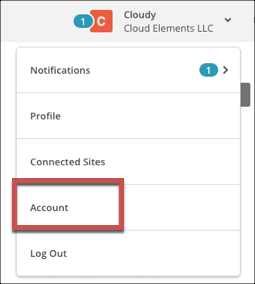
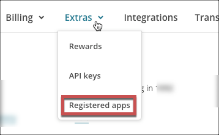
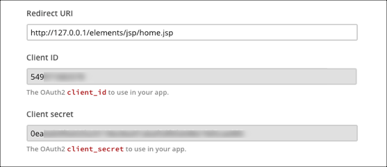
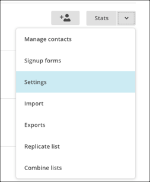

# API Provider Setup

To authenticate a {{page.heading}} element instance you must register an app with {{page.apiProvider}}. When you authenticate, use the **{{page.apiKey}}**, **{{page.apiSecret}}**, and **{{page.callbackURL}}** as the **API Key**, **API Secret**, and **Callback URL**.  If you plan to monitor events, also configure the **Webhook URL**.

See the latest setup instructions in the [{{page.apiProvider}} documentation](https://developer.mailchimp.com/documentation/mailchimp/reference/authorized-apps/).



## Locate Credentials for Authentication

If you already created an application, follow the steps below to locate the **{{page.apiKey}}**, **{{page.apiSecret}}**, and **{{page.callbackURL}}**. If you have not created an app, see [Create an Application](#create-an-application).

To find your OAuth 2.0 credentials:

1. Log in to your account at [{{page.apiProvider}}](mailchimp.com).
2. In the upper right corner, click your name, and then select **Account**.

3. Click **Extras**, and then select **Registered apps**.

4. Locate your app, and then click **Edit**.
2. Scroll down and record the the **{{page.callbackURL}}**, **{{page.apiKey}}**, and **{{page.apiSecret}}**.

## Create an Application

If you have not created an application, you need one to authenticate with {{page.apiProvider}}.

To create an application:

1. Log in to your account at [{{page.apiProvider}}](mailchimp.com).
2. In the upper right corner, click your name, and then select **Account**.

3. Click **Extras**, and then select **Registered apps**.

2. Click **Register an App**.
3. Complete the required information.
4. In **{{page.callbackURL}}** enter the URL that will receive the authorization grant code and return users upon authentication during the OAuth Authorization process.
4. Click **Create**.
2. Scroll down and record the the **{{page.callbackURL}}**, **{{page.apiKey}}**, and **{{page.apiSecret}}**.

## Set Up Events

{{page.apiProvider}} supports webhooks. If you want to enable events when you authenticate an element instance, complete the steps below to set up webhooks with {{page.heading}}.

1. Log in to your account at [{{page.apiProvider}}](mailchimp.com).
2. Navigate to your **Lists**
3. Choose the list to add a webhook to, and then navigate to the Settings.

4. Scroll down and click **Webhooks**.
5. Click **Create New Webhook**.
6. Set up your webhook, and then click **Save**.
3. In **Webhook URL** enter `https://api.cloud-elements.com/elements/api-v2/events/{{page.elementKey}}`.
4. Click **Save**.
5. Test the webhook. Click **Send ping webhook** and watch for a status code of 200.
6. Record the **Webhook URL** which you will use when you set up events as the **Event Notification Callback URL**.

Next [authenticate an element instance with {{page.apiProvider}}](authenticate.html).

## Endpoint Setup

Follow these steps to setup your MailChimp application with the endpoint.

Via a web browser, login to your MailChimp account:
[http://mailchimp.com/](http://mailchimp.com/)

1. Click the arrow up near your profile

2. Select ‘Account’

3. Under ‘Extras’ select ‘Registered apps’

4. Click ‘Register an app’

5. Input app info

6. Input a ‘Redirect URI’

7. Click ‘Create’

8. Make note of the ‘Client ID’, ‘Client Secret’ and ‘Redirect URI’ as they are needed for provisioning

Next [create an instance](mailchimp-create-instance.html).
