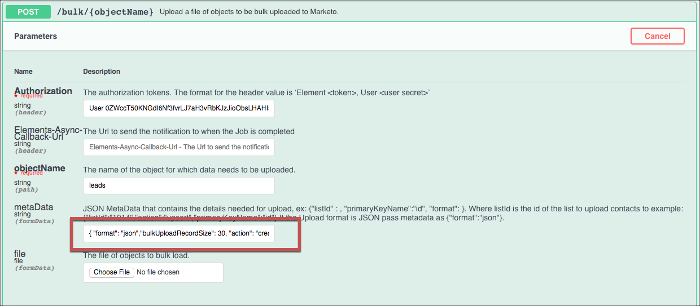

## Tips

The Tips section includes more information about the element including FAQs, endpoint limitations, and general tips.

### Bulk
* Marketo limits users to 10,000 API calls per day. This can present an issue when making bulk queries. To help, use a query such as `select * from myContact limit 10000`. This will download only 10,000 contacts. You can then use the `continueFromJobId` parameter of the `POST /bulk/query`  API to continue fetching the next 10,000 contacts. Continue chaining the queries together until you retrieve all of the contacts.  Each API in Marketo returns approximately 300 leads/records.
* When using bulk to upload records, Marketo supports only upsert functionality (`createOrUpdate`). If you want to create, but not update records, include `bulkUploadRecordSize` and `"action": "create"` in the metaData passed with the bulk request. Where `bulkUploadRecordSize`is the number of records to include in a batch. If you have 100 records and include `"bulkUploadRecordSize": 30`, we will create thirty records at a time until all 100 records are uploaded.

    Here's an example:
    

    

### Events
Although Marketo supports webhooks, you might consider an alternative due to the API limit. You can use the `GET /changed-contacts` API instead.
