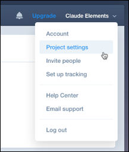
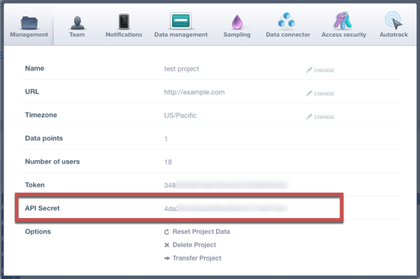

# API Provider Setup

To authenticate a {{page.heading}} element instance you must create project in {{page.heading}}. When you authenticate, use the **{{page.username}}** from the Mixpanel project.

To find your {{page.username}}:

1. Log in to your developer account at [{{page.heading}}](https://mixpanel.com).
2. Access Project Settings.

3. Record the **{{page.username}}**.

