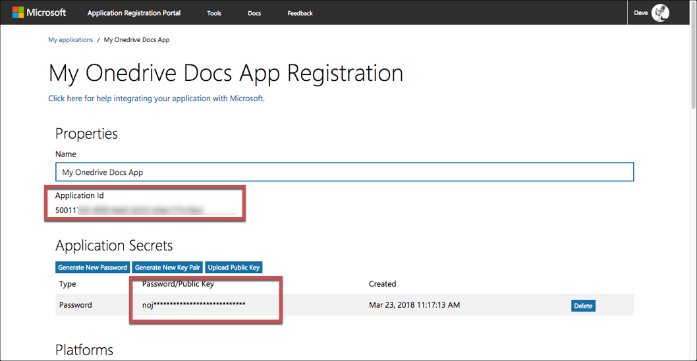

# API Provider Setup

To authenticate a {{page.heading}} element instance you must register an app with {{page.apiProvider}}. Then when you authenticate, use the **{{page.apiKey}}**, **{{page.apiSecret}}**, and **{{page.callbackURL}}** from your registered app as the **API Key**, **API Secret**, and **Callback URL**.  If you plan to monitor events, also configure the **Webhook URL**.

{% include note.html content="Microsoft now uses the v2.0 endpoint when you register an app at the <a href=https://apps.dev.microsoft.com/?referrer=https://azure.microsoft.com/documentation/articles&deeplink=/appList>app registration portal</a>. Apps created through this process are considered <strong>converged apps</strong>. With converged apps you can accept sign-ins form Microsoft Accounts and Azure AD accounts. Any app that you create at the <a href=https://apps.dev.microsoft.com/?referrer=https://azure.microsoft.com/documentation/articles&deeplink=/appList>app registration portal</a> is a converged app by default.  " %}

If you've already set up an app and just need to know how to find your **{{page.apiKey}}** and **{{page.apiSecret}}**, see [Locate Credentials for Authentication](#locate-credentials-for-authentication). If you need to register an app, see [Create an Application](#create-an-application).

See the latest setup instructions in the [{{page.apiProvider}} documentation](https://docs.microsoft.com/en-us/onedrive/developer/rest-api/getting-started/graph-oauth).



## Locate Credentials for Authentication

If you already created an application, follow the steps below to locate the **{{page.apiKey}}**, **{{page.apiSecret}}**, and **{{page.callbackURL}}**. If you have not created an app, see [Create an Application](#create-an-application).

To find your OAuth 2.0 credentials:

1. Log in to your account at [{{page.apiProvider}}](https://apps.dev.microsoft.com/#/appList).
2. Click the application that you want to connect.
3. Record the **{{page.apiKey}}**.
4. If you don't know the **{{page.apiSecret}}**, click **Generate New Password** to get a new one and record it.
4. Record the **{{page.callbackURL}}** for your app.

## Create an Application

If you have not created an application, you need one to authenticate with {{page.apiProvider}}.

To create an application:

1. Log in to your account at [{{page.apiProvider}}](https://apps.dev.microsoft.com/#/appList).
2. Click **Add an App**.
3. Enter a name, and then click **Create**
4. Record the **{{page.apiKey}}**.
5. Under **Application Secrets**, click **Generate New Password**, record the **{{page.apiSecret}}**, and then click **OK**.

    

5. Under **Platforms**, click **Add Platform**, and then select **Web**.
6. In **Redirect URLs** enter the URL to redirect the user to at the end of the OAuth 2.0 authentication process. For example, the Cloud Elements 2.0 callback URL is `https://auth.cloudelements.io/oauth`.
7. Under **Microsoft Graph Permissions** add the permissions needed to use your app. See [Permissions](#permissions) for details.
8. Save your app.

## Permissions

When creating your app be aware of the permissions that you set. You will pass the scopes that you select when you request an OAuth 2.0 URL from during the authentication process. See [Authorization and sign-in for OneDrive in Microsoft Graph](https://docs.microsoft.com/en-us/onedrive/developer/rest-api/getting-started/graph-oauth#authentication-scopes) for more information.

Each OneDrive resource requires specific permissions. Review the [OneDrive Permissions docs](https://developer.microsoft.com/en-us/graph/docs/api-reference/v1.0/resources/permission) for the permissions to set for your app. Recommended permissions include:

| Permission Type | Permissions   |
| :------------- | :------------- |
|  Delegated (work or school account)  |  Files.ReadWrite, Files.ReadWrite.All, Sites.ReadWrite.All offline_access  |
| Delegated (personal Microsoft account)	 | Files.ReadWrite, Files.ReadWrite.All offline_access |
| Application   | Files.ReadWrite.All, Sites.ReadWrite.All offline_access |

Next [authenticate an element instance with {{page.apiProvider}}](authenticate.html).
