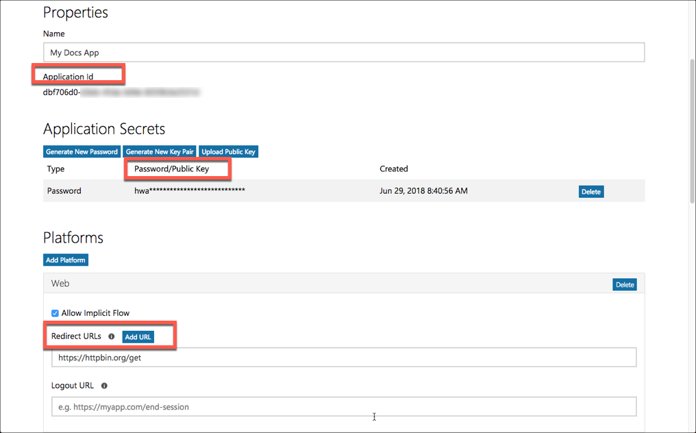
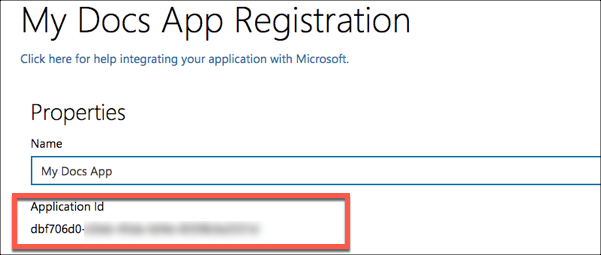
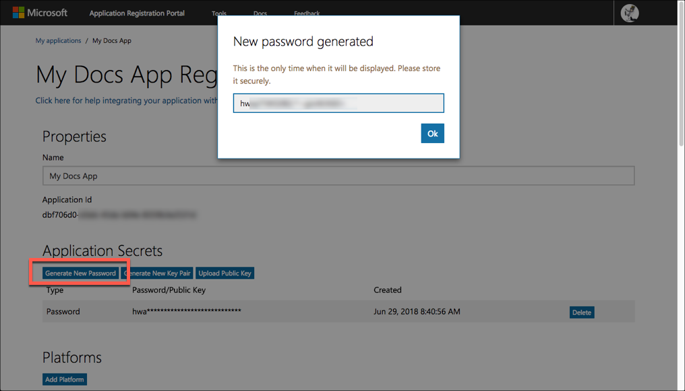

# API Provider Setup

To authenticate an {{page.heading}} element instance you must register an app with {{page.apiProvider}}. Then when you authenticate, use the **{{page.apiKey}}**, **{{page.apiSecret}}**, and **{{page.callbackURL}}** from your registered app as the **API Key**, **API Secret**, and **Callback URL**.

If you've already set up an app and just need to know how to find your **{{page.apiKey}}** and **{{page.apiSecret}}**, see [Locate Credentials for Authentication](#locate-credentials-for-authentication). If you need to register an app, see [Create an Application](#create-an-application).

See the latest setup instructions in the [{{page.apiProvider}} documentation](https://developer.microsoft.com/en-us/graph/docs/concepts/auth_register_app_v2).



## Locate Credentials for Authentication

If you already created an application, follow the steps below to locate the **{{page.apiKey}}**, **{{page.apiSecret}}**, and **{{page.callbackURL}}**. If you have not created an app, see [Create an Application](#create-an-application).

To find your OAuth 2.0 credentials:

1. Log in to your account at [{{page.apiProvider}}](https://apps.dev.microsoft.com/#/appList).
2. Click the application that you want to connect.
3. Record the **{{page.apiKey}}**.
4. If you don't know the **{{page.apiSecret}}**, click **Generate New Password** to get a new one and record it.
4. Record the **{{page.callbackURL}}** for your app.

## Create an Application

If you have not created an application, you need one to authenticate with {{page.apiProvider}}.

To create an application:

1. Log in to your account at [{{page.apiProvider}}](https://apps.dev.microsoft.com/#/appList).
2. Click **Add an App**.
3. Enter a name, and then click **Create**
4. Record the **{{page.apiKey}}**.

5. Under **Application Secrets**, click **Generate New Password**, record the **{{page.apiSecret}}**, and then click **OK**.

    

    

5. Under **Platforms**, click **Add Platform**, and then select **Web**.
6. In **Redirect URLs** enter the URL to redirect the user to at the end of the OAuth 2.0 authentication process. For example, the Cloud Elements 2.0 callback URL is `https://auth.cloudelements.io/oauth`.
7. Under **Outlook Email Permissions** add the permissions needed to use your app. Review the [Mail Permissions in Microsoft's documentation](https://developer.microsoft.com/en-us/graph/docs/concepts/permissions_reference#mail-permissions).
8. Add any additional information, and then save your app.

Next [authenticate an element instance with {{page.apiProvider}}](authenticate.html).
