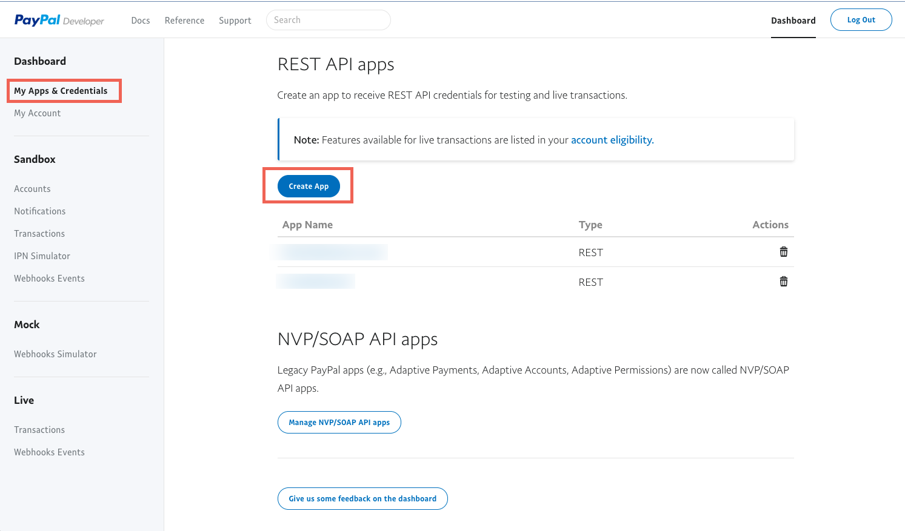
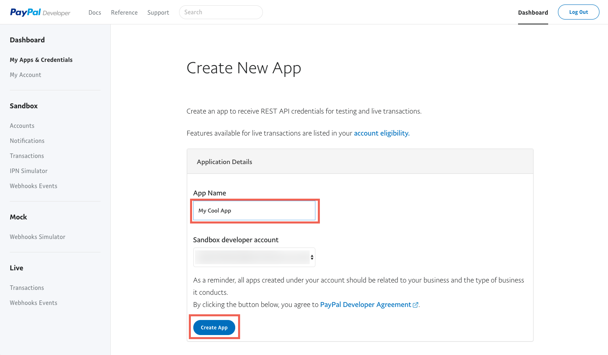
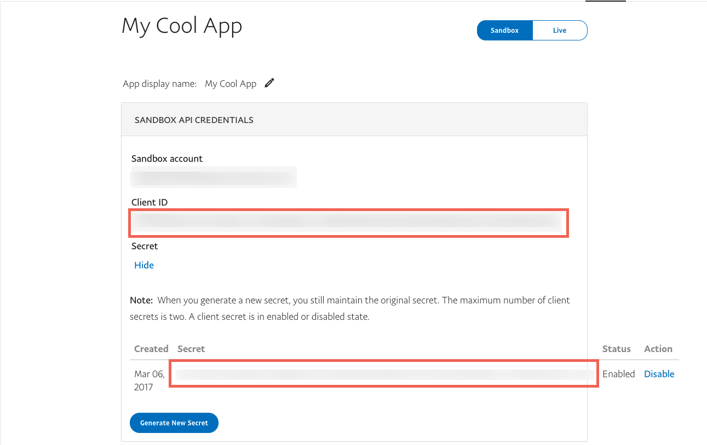

## Endpoint Setup

Log in to your PayPal developer profile at [https://developer.paypal.com/](https://developer.paypal.com/).

Under My Apps & Credentials > REST API apps > Click Create App

Name the app and click Create App

Copy the Client ID and Secret

Next [create an instance](paypal-create-instance.html).
